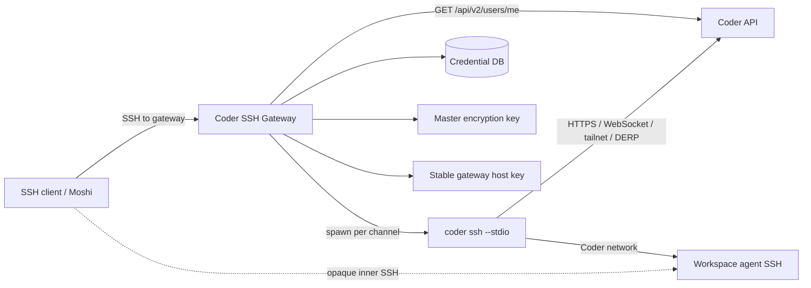
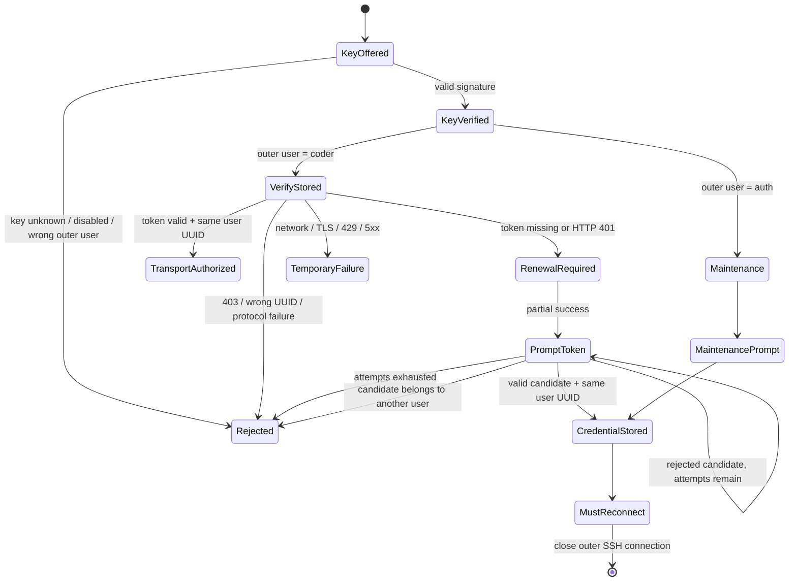

# Coder SSH Gateway

## Research and implementation design

**Status:** implementation specification for an initial open-source release  
**Research date:** 2026-09-03  
**Primary Coder baseline:** Coder `v2.36.4`, released 2026-09-01  
**Additional source review:** Coder `main` at commit `219fbd2e283a3f608f0cd2b1e8f90c1b82f702b7`  
**Recommended implementation language:** Go  
**Working project name:** **Coder SSH Gateway**

> This document is written to be handed directly to a Codex implementation session. It records the protocol decisions, security boundaries, data model, token-renewal design, process lifecycle, deployment model, tests, and source research needed to build the gateway without having to rediscover the architecture.

### Navigation

- **Design and trust model:** sections 1–7
- **SSH authentication and renewal:** sections 8–16
- **Workspace routing and Coder transport:** sections 17–20
- **Storage, encryption, and concurrency:** sections 21–23
- **Go implementation:** sections 24–27
- **Configuration and operations:** sections 28–37
- **Testing and Codex handoff:** sections 38–47

---

## 1. Executive decision

Build a narrowly scoped SSH jump server that converts an SSH `direct-tcpip` channel into a `coder ssh --stdio` process for a validated Coder workspace target.

The gateway should **not** terminate or translate the user's actual workspace SSH session during normal operation. Instead, there are two nested SSH connections:

1. **Outer SSH connection:** client to Coder SSH Gateway.
   - Authenticates the device/user by public key.
   - Associates that public key with one Coder account and stored Coder credential.
   - Accepts only a tightly restricted jump-host channel.

2. **Inner SSH connection:** client to the Coder workspace agent.
   - Travels as opaque bytes through the outer `direct-tcpip` channel and `coder ssh --stdio`.
   - Carries the actual shell, PTY, `exec`, Herdr/tmux/Zellij discovery, SFTP, agent forwarding, and SSH port-forwarding semantics.
   - Is handled by Coder's workspace agent, not reimplemented by the gateway.

Normal data path:

```text
Moshi / OpenSSH / another SSH client
          |
          | outer SSH: public-key authenticated
          v
+----------------------------------------+
| Coder SSH Gateway                      |
|                                        |
| direct-tcpip target                    |
|   -> validate workspace hostname       |
|   -> load per-user Coder token         |
|   -> spawn coder ssh --stdio            |
|   -> copy opaque bytes both ways       |
+----------------------------------------+
          |
          | Coder control plane + tailnet
          v
Coder workspace agent SSH server
          |
          v
shell / Herdr / tmux / SFTP / forwarding
```

This mirrors Coder's own generated OpenSSH setup. Coder's [`config-ssh`](https://coder.com/docs/reference/cli/config-ssh) writes a `ProxyCommand` that runs [`coder ssh --stdio`](https://coder.com/docs/reference/cli/ssh). The current implementation is visible in [`cli/configssh.go`](https://github.com/coder/coder/blob/v2.36.4/cli/configssh.go) and [`cli/ssh.go`](https://github.com/coder/coder/blob/v2.36.4/cli/ssh.go).

The initial product should support one Coder deployment per gateway listener. The storage schema can be deployment-aware from the beginning, but multi-deployment routing should not complicate the MVP.

---

## 2. Required user experience

### 2.1 Normal workspace connection

A Moshi connection should be configured approximately as:

```text
Connection type: SSH
Host:             herdr-workspace
Port:             22
Workspace user:   coder (or the user's normal Coder SSH username)

Jump host:
  Host:           gateway.example.com
  Port:           22
  User:           coder
  Authentication: registered SSH public key
```

The target hostname names the workspace. The jump-host username selects the gateway's normal transport mode. The SSH public key identifies the Coder account.

The gateway then runs the equivalent of:

```bash
CODER_URL=https://coder.example.com \
CODER_SESSION_TOKEN='<stored-user-token>' \
/usr/local/bin/coder \
  --global-config /var/lib/coder-ssh-gateway/coder-config \
  ssh \
  --stdio \
  --wait=auto \
  herdr-workspace
```

No shell is involved. Every argument is passed separately after strict validation.

### 2.2 Expired or revoked Coder credential

When a registered public key is valid but its stored Coder token is missing or rejected with HTTP `401`, the gateway should attempt this flow:

1. Accept proof of the registered SSH private key as the first authentication factor.
2. Return SSH **partial authentication success**.
3. Offer both:
   - `keyboard-interactive`, with a hidden prompt explicitly labeled `Coder token:`
   - `password`, interpreting the supplied password bytes as a Coder token for clients that expose only a password prompt
4. Tell the user where to obtain a fresh token:
   - `https://<coder-deployment>/cli-auth`
5. Validate the candidate token against `GET /api/v2/users/me`.
6. Require the returned immutable Coder user UUID to match the account already bound to the SSH key.
7. Encrypt and atomically store the token only after validation succeeds.
8. Confirm that the token was accepted.
9. Deliberately disconnect the SSH transport.
10. The client's next reconnect follows the normal path to the requested workspace.

The deliberate disconnect is a product requirement, not an error. It avoids subtle state transitions inside an already negotiated jump connection and gives a simple contract:

> A credential-repair connection repairs credentials only. The next connection opens the workspace.

### 2.3 Deterministic credential-maintenance fallback

Client support for public-key partial success followed by keyboard-interactive or password must be tested. Moshi documents SSH key authentication, password authentication, and jump hosts, but does not currently document this exact multi-step authentication sequence.

Therefore the gateway must also expose a small built-in maintenance session:

```bash
ssh auth@gateway.example.com
```

This connection:

- requires the same registered public key;
- does **not** require a currently valid Coder token;
- accepts a normal outer SSH `session` channel only for a built-in credential-repair interface;
- prompts for a new token without echoing it;
- validates and stores the token;
- prints confirmation;
- exits successfully and disconnects.

There is no real shell. It must not execute arbitrary commands.

This should be configured as a second saved Moshi connection named something like **Coder Gateway Auth**. It is the guaranteed recovery path when the jump-host authentication UI does not display the automatic token prompt.

---

## 3. Goals

The first release must:

- Let any standards-compliant SSH client that supports a jump host reach Coder workspaces.
- Work with Moshi's SSH mode and preserve Moshi's noninteractive Herdr/tmux/Zellij discovery.
- Require SSH public-key authentication at the outer gateway.
- Map each approved SSH key to a specific Coder account.
- Store a separate Coder credential per account.
- Validate a Coder credential before allowing transport use.
- Detect expired, revoked, or otherwise unauthorized credentials.
- Support interactive replacement of an invalid credential.
- Bind replacement credentials to the same immutable Coder user UUID.
- Disconnect after successful credential replacement.
- Accept only `direct-tcpip` transport to a strict bare workspace target and port 22.
- Preserve the complete inner SSH protocol without translating it.
- Use the official Coder CLI's `ssh --stdio` path rather than reproducing Coder tailnet behavior.
- Never place the Coder token on a command line.
- Never store the Coder token in plaintext at rest.
- Never log the token or inner SSH payload.
- Have bounded resource usage, process supervision, rate limits, and auditable control-plane events.
- Be deployable as a single Linux binary plus a pinned Coder CLI binary.
- Be usable as a single-replica SQLite deployment and have a clear path to PostgreSQL/KMS-based HA.

---

## 4. Non-goals for the MVP

The initial release should not:

- Implement a terminal emulator.
- Implement an iOS app.
- Implement Mosh UDP transport.
- Implement Eternal Terminal transport.
- Reimplement Coder's tailnet, DERP, workspace resolution, or workspace-start logic.
- Translate inner SSH session requests.
- Inspect shell commands or terminal data.
- Provide arbitrary TCP forwarding through the outer SSH server.
- Allow unknown SSH keys to self-enroll.
- Use a shared Coder administrator token to impersonate users.
- Support arbitrary Coder deployments selected from the inner destination hostname.
- Provide a general-purpose SSH bastion shell.
- Promise seamless failover for established TCP/SSH sessions.
- Depend on Coder's internal deterministic workspace host-key implementation.
- Parse human-readable Coder CLI error strings as the primary credential-validity signal.
- Download and execute a new Coder binary during an incoming SSH connection.

Mosh remains out of scope because it uses SSH only for bootstrap and then requires direct UDP reachability to the final host. Moshi documents this distinction in its [connection documentation](https://getmoshi.app/docs/connections), and the Mosh protocol is described at [mosh.org](https://mosh.org/).

---

## 5. Why the jump-proxy design is the right abstraction

### 5.1 `direct-tcpip` already contains the required routing information

SSH jump hosts use a `direct-tcpip` channel. Under [RFC 4254 section 7.2](https://www.rfc-editor.org/rfc/rfc4254.html#section-7.2), the channel-open payload contains:

```text
target host
target port
originator IP address
originator port
```

The target host is exactly the workspace-routing input the gateway needs. The gateway does not need an SSH equivalent of TLS SNI, and it does not need to encode the workspace in the outer username.

The originator address and port are supplied by the client and must not be trusted for security or audit attribution. The actual outer TCP peer address is authoritative.

### 5.2 It preserves all inner SSH features

After the gateway opens `coder ssh --stdio`, the client's bytes are an ordinary SSH connection to the workspace agent. As a result, these features remain end-to-end inside the inner SSH connection:

- PTY allocation and resize
- interactive shell
- noninteractive `exec`
- exit status and signals
- Herdr/tmux/Zellij discovery
- local and remote forwarding supported by the workspace SSH server
- agent forwarding
- SFTP/SCP support exposed by the workspace agent
- future SSH extensions that require no gateway awareness

Moshi's [multiplexer discovery](https://getmoshi.app/docs/multiplexer) runs noninteractive commands such as `command -v herdr`, `command -v tmux`, and `command -v zellij`. A shell-only relay would have to imitate these semantics. A byte-transparent jump proxy does not.

### 5.3 It avoids becoming an SSH protocol translator

A server that accepted:

```bash
ssh workspace-name@gateway.example.com
```

as the final SSH endpoint would have to terminate the user's actual SSH connection and then translate at least:

- `pty-req`
- `window-change`
- `shell`
- `exec`
- `env`
- signals
- exit status
- agent forwarding
- direct and reverse forwarding
- subsystem requests such as SFTP

That design also puts terminal plaintext at the gateway by construction. The `direct-tcpip` design avoids both problems.

---

## 6. Trust boundaries and security properties

### 6.1 Outer SSH connection

The outer SSH connection is the gateway's real authentication boundary.

It provides:

- gateway server authentication through a stable outer SSH host key;
- client/device authentication through a registered SSH public key;
- encrypted transport for credential-renewal prompts;
- authorization to request a Coder-backed workspace transport.

The outer host key must be generated once, persisted, backed up, and presented consistently across replicas.

### 6.2 Coder credential

The stored Coder token authorizes the gateway to act as that Coder user. It is a high-value bearer credential.

The gateway must:

- store one token per bound Coder account;
- validate it over HTTPS;
- encrypt it at rest;
- expose it only to the verifier and the short-lived Coder child process;
- never use an administrator token to bypass Coder's normal authorization;
- never accept a replacement token for a different Coder user.

### 6.3 Inner SSH connection

The inner SSH stream is opaque during honest operation. The gateway forwards encrypted SSH packets and does not need the inner session keys.

That is a useful privacy property, but it is **not** a strong security boundary against a compromised gateway:

- Coder's agent SSH server currently uses no client authentication because authorization has already occurred through Coder.
- Coder's workspace host-key behavior is intentionally not a conventional independent authentication boundary.
- A malicious gateway controls the byte stream and could substitute a different SSH server if the client accepts or cannot meaningfully authenticate the inner host key.

Therefore describe the property accurately:

> The normal gateway implementation does not inspect inner terminal plaintext. A compromised gateway remains capable of stealing stored Coder credentials and attacking workspace connections.

### 6.4 Coder control plane

Coder remains authoritative for:

- whether the token is valid;
- which Coder user owns it;
- whether that user can see the workspace;
- whether the workspace may be started;
- which agent should be selected;
- how the tailnet/DERP connection is established;
- workspace connection auditing and activity.

The gateway validates syntax and its own account mapping; it must not duplicate or weaken Coder authorization.

---

## 7. High-level architecture



Logical components:

```text
listener
  -> connection admission/rate limit
  -> SSH handshake and public-key authentication
  -> Coder credential verifier
  -> channel dispatcher
       -> direct-tcpip route validator
       -> Coder process supervisor
       -> bidirectional stream copier
       -> maintenance-session handler
  -> encrypted credential store
  -> audit logger
  -> metrics/health endpoints
```

Recommended package boundaries are provided later in this document.

---

## 8. SSH protocol contract

### 8.1 Outer SSH usernames

Reserve exactly two outer usernames:

| Username | Meaning | Authentication | Allowed channel |
|---|---|---|---|
| `coder` | Workspace transport | registered key plus valid Coder credential | `direct-tcpip` only |
| `auth` | Credential maintenance | registered key only | restricted `session` only |

All other usernames receive a generic authentication failure.

The names should be configurable, but these defaults are clear and stable.

### 8.2 Public-key-only first factor

The top-level `ssh.ServerConfig` must advertise only public-key authentication.

Do **not** set a top-level password or keyboard-interactive callback. Otherwise an unrecognized client could attempt token-only authentication without proving possession of a registered SSH private key.

Password and keyboard-interactive callbacks are introduced only through `ssh.PartialSuccessError.Next`, after a registered public key has been cryptographically verified.

### 8.3 Approved outer channel types

Transport mode:

- allow `direct-tcpip`;
- reject `session`;
- reject `forwarded-tcpip`;
- reject agent channels;
- reject X11;
- reject unknown channel types.

Maintenance mode:

- allow one `session` channel;
- reject `direct-tcpip`;
- reject every other channel type.

### 8.4 Approved outer global requests

Default behavior is to drain all global requests and reply `false`.

May reply `true` to harmless keepalive requests such as:

```text
keepalive@openssh.com
```

Explicitly reject:

- `tcpip-forward`
- `cancel-tcpip-forward`
- any request that would establish reverse forwarding
- vendor requests not deliberately supported

The outer server is not a general bastion. All forwarding features intended for the workspace remain inside the inner SSH connection.

### 8.5 Channel-open failure codes

Use the RFC 4254 reason codes consistently:

| Condition | SSH channel-open reason |
|---|---|
| target grammar/port not allowed | `SSH_OPEN_ADMINISTRATIVELY_PROHIBITED` |
| unsupported channel type | `SSH_OPEN_UNKNOWN_CHANNEL_TYPE` |
| global/process/account limit reached | `SSH_OPEN_RESOURCE_SHORTAGE` |
| Coder child cannot establish transport | channel is normally already accepted; close it and audit as connect failure |
| pre-accept internal connect failure | `SSH_OPEN_CONNECT_FAILED` |

Channel error descriptions are best-effort only. Many clients do not display them.

---

## 9. SSH library requirements

Use [`golang.org/x/crypto/ssh`](https://pkg.go.dev/golang.org/x/crypto/ssh).

### 9.1 Minimum safe version

Use `golang.org/x/crypto` **v0.52.0 or newer** and run `govulncheck` in CI. Prefer pinning the current reviewed release rather than an unconstrained version.

Versions before v0.52.0 were affected by [GO-2026-5014 / CVE-2026-39828](https://pkg.go.dev/vuln/GO-2026-5014), involving restrictions returned with `PartialSuccessError`. This project relies directly on partial SSH authentication, so the minimum version is a hard security requirement.

At the research date, pkg.go.dev listed `v0.56.0` as current. Pin an exact version in `go.mod` and update it deliberately.

### 9.2 Safe algorithm set

Use the library's supported safe algorithm set rather than legacy defaults:

```go
algorithms := ssh.SupportedAlgorithms()

serverConfig.Config.KeyExchanges = algorithms.KeyExchanges
serverConfig.Config.Ciphers = algorithms.Ciphers
serverConfig.Config.MACs = algorithms.MACs
serverConfig.PublicKeyAuthAlgorithms = algorithms.PublicKeyAuths
```

Do not add SHA-1 `ssh-rsa` merely for broad compatibility. Add legacy algorithms only through an explicit, loudly documented compatibility option.

### 9.3 `PublicKeyCallback` is not proof of possession

The SSH client may query whether a key is acceptable before signing anything. The x/crypto documentation explicitly warns that `PublicKeyCallback` can run before proof of possession.

Use this division:

- `PublicKeyCallback`
  - normalize and hash the offered public key;
  - look it up in the local credential database;
  - confirm the requested outer username is allowed;
  - return candidate account/key IDs in `Permissions.Extensions`;
  - perform no Coder network call;
  - do not record a successful login.

- `VerifiedPublicKeyCallback`
  - runs only after the client proves possession of the private key;
  - loads the account and credential;
  - validates the Coder token for transport mode;
  - returns final permissions, or partial success with renewal callbacks.

The relevant callback behavior is documented in the current [`ssh.ServerConfig` source](https://github.com/golang/crypto/blob/master/ssh/server.go).

### 9.4 Per-connection server configuration

Create a shallow copy of an immutable base `ssh.ServerConfig` for each accepted TCP connection and install callbacks that close over a per-connection state object.

This is better than a global map keyed by remote addresses and gives the renewal callbacks direct access to:

- a generated connection ID;
- the accepted raw peer address;
- the `ServerPreAuthConn`;
- retry counters;
- audit context;
- the verified account;
- the `mustReconnect` state.

Conceptually:

```go
func (s *Server) handleTCP(raw net.Conn) {
    state := newConnectionState(raw)

    cfg := *s.baseSSHConfig // base config is immutable after startup
    cfg.PublicKeyCallback = s.publicKeyCallback(state)
    cfg.VerifiedPublicKeyCallback = s.verifiedPublicKeyCallback(state)
    cfg.PreAuthConnCallback = func(c ssh.ServerPreAuthConn) {
        state.setPreAuthConn(c)
    }

    serverConn, channels, requests, err := ssh.NewServerConn(raw, &cfg)
    // ...
}
```

Do not mutate slices or maps referenced by the shared base config after the server starts.

### 9.5 Partial success permissions rule

When returning `*ssh.PartialSuccessError`, return **nil permissions**:

```go
return nil, &ssh.PartialSuccessError{
    Next: ssh.ServerAuthCallbacks{
        KeyboardInteractiveCallback: renewalKeyboardInteractive(account, state),
        PasswordCallback:            renewalPassword(account, state),
    },
}
```

Current x/crypto enforces this. Final permissions are created only after the additional authentication step succeeds.

### 9.6 Authentication banners

`ssh.BannerError` cannot safely be wrapped around `PartialSuccessError` in the current implementation because banner detection uses `errors.As`, while partial-success handling uses a direct type assertion.

Use `ServerPreAuthConn.SendAuthBanner` for dynamic renewal instructions and success confirmation.

Because callbacks are per-connection closures, the `PreAuthConnCallback` can store the corresponding `ServerPreAuthConn` directly in that connection's state. Do not build a global address-based registry.

---

## 10. Account identity model

### 10.1 SSH key identifies the gateway account

A registered public key maps to:

```text
gateway account
  -> Coder deployment
  -> immutable Coder user UUID
  -> encrypted Coder token
```

The workspace is **not** selected by the outer key and is not encoded in the outer username. It arrives later in the `direct-tcpip` target hostname.

### 10.2 Store the exact key, not only a display fingerprint

For each key, store:

- canonical `ssh.PublicKey.Marshal()` bytes;
- SHA-256 digest of those bytes for indexed lookup;
- standard `SHA256:...` fingerprint for display;
- key algorithm;
- label;
- account ID;
- enabled/revoked state;
- creation and last-used timestamps.

A fingerprint is for humans. The exact canonical key bytes or their collision-resistant digest are the authoritative lookup key.

### 10.3 SSH certificate support

The MVP should reject SSH certificates unless certificate authentication is designed explicitly.

Supporting certificates safely requires decisions about:

- trusted user CA keys;
- principals;
- certificate serials and validity;
- whether the underlying key or certificate identity maps to the Coder account;
- revocation.

Ordinary Ed25519, ECDSA, RSA-SHA2, and supported security-key public keys are enough for the first release.

### 10.4 Coder user binding

Bind each account to the immutable `id` returned by:

```http
GET /api/v2/users/me
Coder-Session-Token: <token>
```

Do not bind by:

- username;
- display name;
- email;
- SSH key comment.

Those fields may change.

A replacement token that returns another UUID must be rejected even if it is a perfectly valid token.

### 10.5 First binding

Support two safe enrollment modes:

1. **Admin-bound account**
   - administrator creates account with known Coder user UUID;
   - administrator registers one or more SSH keys.

2. **Explicit bind-on-first-token account**
   - administrator creates a disabled/unbound account and registers the key;
   - administrator deliberately enables `bind_on_first_token`;
   - the first successfully validated token permanently binds the returned user UUID.

An unknown SSH key must never be allowed to create an account simply by supplying a valid Coder token.

---

## 11. Coder credential verification

### 11.1 Use a minimal HTTP verifier

The gateway should implement credential validation with the standard Go HTTP client rather than importing Coder's internal Go packages.

Request:

```http
GET /api/v2/users/me HTTP/1.1
Host: coder.example.com
Accept: application/json
Coder-Session-Token: <candidate-token>
User-Agent: coder-ssh-gateway/<version>
```

Relevant official sources:

- [Coder API authentication and user API](https://coder.com/docs/reference/api/users)
- [Coder CLI environment and session token](https://coder.com/docs/reference/cli)
- [`coderd/httpmw/apikey.go`](https://github.com/coder/coder/blob/v2.36.4/coderd/httpmw/apikey.go)
- [`codersdk/apikey.go`](https://github.com/coder/coder/blob/v2.36.4/codersdk/apikey.go)

### 11.2 HTTP client hardening

For each configured deployment:

- require HTTPS outside an explicit development mode;
- verify the server certificate and hostname;
- support a configured custom CA bundle;
- support mTLS if required;
- use a bounded timeout, initially 10 seconds;
- cap the response body, for example at 1 MiB;
- do not follow cross-origin redirects;
- preferably reject all redirects as deployment misconfiguration;
- add only administrator-configured static headers;
- never send the Coder token to another host;
- do not use `InsecureSkipVerify`;
- reuse an `http.Transport` safely across requests;
- set reasonable idle connection limits.

### 11.3 Validation response

On `200`, parse at least:

```json
{
  "id": "immutable-user-uuid",
  "username": "current-username",
  "status": "active"
}
```

Require:

- valid JSON;
- valid nonzero UUID;
- body within the size limit;
- expected identity match when already bound.

Cache username/display fields only for diagnostics. UUID is authoritative.

### 11.4 Error classification

Do not collapse every failure into “token expired.”

| Result | Classification | Action |
|---|---|---|
| `200` with expected UUID | valid | permit transport |
| `200` with different UUID | wrong identity | reject; security audit; never store |
| `401` | missing/expired/revoked/provider session invalid/inactive | offer token renewal |
| `403` | token may be valid but scope is insufficient | do not overwrite automatically; explain scope/authorization |
| `404` | incompatible endpoint or incorrect base URL | configuration/version error |
| `429` | rate limited | temporary control-plane failure; do not prompt for another token |
| `5xx` | Coder unavailable | temporary control-plane failure; do not prompt |
| TLS/DNS/connect timeout | Coder unavailable | temporary control-plane failure; do not prompt |
| malformed successful response | protocol/security error | fail closed |
| redirect | configuration/security error | fail closed |

Coder's current authentication middleware returns `401` when an API key is expired and can also return `401` when the linked OAuth/OIDC session can no longer be refreshed. A newly generated `/cli-auth` token is the appropriate recovery path in either case. An inactive user may also need administrator action; the maintenance UI should say so if a newly generated token is still rejected.

### 11.5 Validation cache

Validate at:

- every outer transport authentication, unless an identical credential generation was validated very recently;
- every `direct-tcpip` channel open if the outer SSH connection has remained alive beyond the cache interval.

Recommended cache key:

```text
deployment ID + account ID + credential generation
```

Recommended initial valid-cache TTL: **15 seconds**.

Use `singleflight` per cache key so simultaneous Moshi preflight connections do not issue redundant Coder API requests.

Never cache an unavailable-control-plane result as an invalid credential.

### 11.6 Sliding session expiry

Coder's normal sessions are short-lived and can be refreshed as they are used unless deployment policy disables session-expiry refresh. Calling `/users/me` therefore both verifies the token and may keep an active gateway credential usable.

The gateway must still handle:

- natural expiration;
- user revocation;
- logout;
- Coder account state changes;
- upstream OAuth/OIDC refresh failures;
- administrator changes to session policy.

See [Coder sessions and tokens](https://coder.com/docs/admin/users/sessions-tokens).

---

## 12. Credential-renewal state machine



The gateway should use typed internal errors rather than string matching:

```go
type CredentialErrorKind string

const (
    CredentialMissing          CredentialErrorKind = "missing"
    CredentialInvalid          CredentialErrorKind = "invalid"
    CredentialForbidden        CredentialErrorKind = "forbidden"
    CredentialWrongIdentity    CredentialErrorKind = "wrong_identity"
    CredentialMalformedReply   CredentialErrorKind = "malformed_reply"
    ControlPlaneUnavailable    CredentialErrorKind = "control_plane_unavailable"
    ControlPlaneIncompatible   CredentialErrorKind = "control_plane_incompatible"
)
```

Only `missing` and `invalid` enter the automatic renewal prompt.


## 13. Automatic renewal during SSH authentication

### 13.1 Normal transport authentication

For outer username `coder`:

```text
public key offered
  -> local key lookup
  -> client proves private-key possession
  -> load account and current credential generation
  -> verify token through Coder
       valid: return transport permissions
       missing/401: return partial success
       other error: reject without asking for a token
```

Final SSH permissions should contain only opaque local identifiers:

```text
mode=transport
account_id=<gateway UUID>
deployment_id=<gateway UUID>
ssh_key_id=<gateway UUID>
credential_generation=<integer>
must_reconnect=false
```

Never place the raw token in `ssh.Permissions.Extensions`.

### 13.2 Keyboard-interactive continuation

The preferred prompt uses [RFC 4256 keyboard-interactive authentication](https://www.rfc-editor.org/rfc/rfc4256.html).

Example:

```go
answers, err := challenge(
    "Coder SSH Gateway",
    "Your saved Coder credential is missing or expired.\n"+
        "Open https://coder.example.com/cli-auth, sign in, and paste the token below.\n"+
        "After the token is verified this connection will close; reconnect to enter the workspace.",
    []string{"Coder token: "},
    []bool{false},
)
```

Requirements:

- `echo=false`;
- no more than three candidate attempts per SSH connection;
- maximum token input length of 4096 bytes;
- trim leading and trailing ASCII whitespace introduced by copy/paste;
- reject NUL and other control characters inside the token;
- do not enforce a brittle token-format regex;
- do not write candidate tokens to logs, metrics, traces, panic output, or audit records;
- validate before changing stored state;
- compare the returned immutable user UUID;
- perform an atomic generation-checked replacement;
- send a success banner or a zero-prompt informational challenge when possible;
- return final permissions with `must_reconnect=true`.

A zero-prompt second challenge may be used to display confirmation:

```go
_, _ = challenge(
    "Coder SSH Gateway",
    "Token verified for Coder user richard. Reconnect to continue to the workspace.",
    nil,
    nil,
)
```

The success of this cosmetic step must not be required for persistence. Some clients may not render a zero-question challenge.

### 13.3 Password continuation

Offer a `PasswordCallback` in the same `PartialSuccessError.Next` value.

The password bytes are interpreted as a Coder token, not as a gateway password. This exists only because some SSH clients expose password authentication but not a distinct keyboard-interactive flow.

Before returning partial success, send an authentication banner through the per-connection `ServerPreAuthConn`:

```text
Your registered SSH key is valid, but the saved Coder credential is missing or expired.
Generate a new token at https://coder.example.com/cli-auth.
At the following password/token prompt, paste that token.
This connection will close after successful validation; reconnect to continue.
```

After validating a password-supplied token, send a second banner if the client accepts it:

```text
Coder token verified. Reconnect to continue.
```

Never permit top-level password authentication. Password is available only after a known key has been signed.

### 13.4 Client compatibility caveat

OpenSSH supports partial public-key success followed by keyboard-interactive or password authentication. The protocol explicitly supports this through the `partial success` bit in [RFC 4252](https://www.rfc-editor.org/rfc/rfc4252.html).

Moshi's public documentation currently confirms:

- SSH jump hosts;
- SSH keys;
- password authentication;
- SSH mode for jump-host routing.

It does not explicitly document public-key partial success followed by another method. Therefore:

- implement the standards-based automatic path;
- test it on a physical iPad with the current Moshi release;
- do not ship without the maintenance-session fallback;
- document the fallback prominently.

### 13.5 Authentication deadlines

`ssh.NewServerConn` includes both key exchange and user authentication. A single short socket deadline would therefore terminate the user while they are opening `/cli-auth` and copying a token.

Use phase-aware deadlines:

- initial SSH handshake and ordinary public-key authentication: 30 seconds by default;
- when the verified-key callback decides renewal is required: extend the raw connection deadline to the configured renewal timeout, initially 5 minutes;
- Coder HTTP verification within the renewal callback: its own 10-second request timeout;
- after normal or maintenance authentication succeeds: clear the raw socket deadline and enforce channel/session timeouts separately;
- after replacement succeeds: close immediately as designed.

Because the callbacks close over per-connection state, the renewal transition can call something equivalent to:

```go
if err := state.RawConn().SetDeadline(
    time.Now().Add(config.RenewalAuthTimeout),
); err != nil {
    return nil, ErrAuthenticationUnavailable
}
```

The renewal timeout is an upper bound against abandoned authentication connections, not a terminal idle timeout.

### 13.6 Forced reconnect after renewal

Once a candidate token has been validated and stored:

1. Return successful final SSH authentication with `must_reconnect=true`.
2. Allow `ssh.NewServerConn` to complete.
3. Send any final best-effort banner before authentication ends.
4. Immediately close the outer SSH connection without starting a channel dispatcher.

Pseudocode:

```go
serverConn, channels, requests, err := ssh.NewServerConn(raw, &cfg)
if err != nil {
    return
}

if serverConn.Permissions != nil &&
    serverConn.Permissions.Extensions["must_reconnect"] == "true" {
    _ = serverConn.Close()
    return
}
```

Do not continue directly into the workspace on that connection. The next client connection re-runs the entire verified-key and token-validation path and carries the original workspace target again.

This exact behavior should be tested because some clients automatically reconnect. Rate limiting must permit one immediate reconnect after successful renewal.

---

## 14. Maintenance-mode SSH server

### 14.1 Authentication

For outer username `auth`:

- require a registered and enabled public key;
- require a valid signature through `VerifiedPublicKeyCallback`;
- do not require or validate the stored Coder token during SSH user authentication;
- return final permissions with `mode=maintenance`.

This guarantees access to the repair interface even when the Coder token is absent or unusable.

### 14.2 Channel behavior

Allow exactly one `session` channel.

Expected request sequence:

```text
pty-req        optional
env            reject or ignore
window-change  accept/ignore
shell          start built-in interface
```

Also allow a deliberately tiny noninteractive command set through `exec`, with exact byte comparisons and no shell:

```text
status
renew
clear
help
```

Everything else is rejected.

Do not run:

```go
exec.Command("sh", "-c", requestedCommand)
```

or any equivalent.

### 14.3 Minimal interactive interface

A simple line-oriented interface is enough:

```text
Coder SSH Gateway credential maintenance

Gateway account: Richard iPad
Coder server:    https://coder.example.com
Coder user:      richard (2f4d...)
Credential:      invalid or expired

Generate a new token at:
https://coder.example.com/cli-auth

Paste Coder token:
```

The channel itself can implement secret input without allocating an operating-system PTY:

- acknowledge `pty-req`, but do not launch a shell or OS PTY;
- read bytes from the SSH channel;
- do not echo token characters;
- support CR/LF completion;
- support backspace/delete;
- support Ctrl-C cancellation;
- enforce the 4096-byte limit;
- print only a newline after completion.

After success:

```text
Token verified for Coder user richard.
The gateway credential has been updated.
Reconnect to the workspace connection.
```

Then send SSH `exit-status` 0, close the channel, and close the outer SSH transport.

On an invalid candidate, permit a bounded retry. On control-plane failure, preserve the old credential and exit nonzero.

### 14.4 `status`

`status` should report only nonsecret state:

- deployment URL;
- account label;
- bound Coder UUID, abbreviated;
- cached username;
- credential state;
- last successful validation time;
- current generation;
- whether the Coder control plane is reachable.

It should not print:

- token prefix or suffix;
- ciphertext;
- key material;
- detailed internal database identifiers unless debug mode is explicitly requested.

### 14.5 `clear`

Call the command `clear`, not `revoke`, unless it also revokes the token at Coder.

`clear` means:

- atomically delete or tombstone the locally stored encrypted token;
- increment the credential generation;
- mark state `missing`;
- require renewal on the next transport login.

It does not invalidate the token elsewhere. Tell the user to revoke it in Coder separately if necessary.

---

## 15. Coder token source and scope choices

### 15.1 Recommended MVP credential

Accept the ordinary token generated by:

```text
https://coder.example.com/cli-auth
```

This is the same user-driven mechanism used by [`coder login`](https://coder.com/docs/reference/cli/login).

Advantages:

- works across normal password, OIDC, and GitHub-authenticated deployments;
- matches Coder's supported CLI workflow;
- carries all permissions the user normally has;
- avoids guessing which API calls `coder ssh` will need in each Coder version;
- preserves workspace autostart behavior.

Disadvantage:

- it is a broad bearer credential, so the gateway's storage security matters.

### 15.2 Scoped token hardening

Current Coder `v2.36.4` contains composite API key scopes in [`coderd/rbac/scopes.go`](https://github.com/coder/coder/blob/v2.36.4/coderd/rbac/scopes.go):

`coder:workspaces.access` expands to:

- template read;
- organization-member read;
- workspace read;
- workspace SSH;
- workspace application-connect.

`coder:workspaces.operate` expands to:

- template read;
- organization-member read;
- workspace read;
- workspace start;
- workspace stop;
- workspace update.

A possible limited token profile for already-running workspaces is:

```text
coder:workspaces.access
user:read
```

A possible profile preserving normal autostart is:

```text
coder:workspaces.access
coder:workspaces.operate
user:read
```

These are **current-source baselines**, not a substitute for an integration matrix. The gateway verifier needs enough scope to read `/users/me`, and `coder ssh` may need related resources as implementation details evolve.

If allow lists are used, remember that Coder operations can touch workspace, template, version, organization-member, and user resources. An incomplete allow list can produce confusing `403` responses.

For the first release:

- support full session tokens;
- document scoped tokens as an advanced option;
- classify `403` separately;
- build automated tests for each officially supported Coder version before claiming a minimum scope set.

### 15.3 Future OAuth flow

Coder can act as an OAuth2 provider. A future gateway could register an OAuth client, request narrow scopes, receive refresh tokens, and provide a browser-based enrollment flow.

That is attractive for a managed multiuser product, but it adds:

- an HTTPS callback service;
- browser authorization;
- client registration;
- PKCE/state handling;
- refresh-token storage and rotation;
- deployment-version compatibility.

It is not required for the jump-proxy MVP or the user's token-paste renewal requirement.

---

## 16. Single-deployment MVP and multi-deployment limitation

### 16.1 Why deployment selection cannot depend on the target hostname during auth

SSH user authentication completes before the client opens a `direct-tcpip` channel.

Therefore, at the moment the gateway must validate a stored Coder token, it does not yet know the requested workspace target hostname. A single listener cannot safely select among multiple Coder deployments solely from the later target.

There is no TLS-SNI-like target name in the initial SSH transport handshake.

### 16.2 MVP rule

Each gateway listener has exactly one active Coder deployment.

A public key maps unambiguously to one account in that deployment.

### 16.3 Future multi-deployment options

Use one of these explicit selectors:

1. **Outer username**
   ```text
   coder+prod
   auth+prod
   coder+lab
   auth+lab
   ```

2. **Dedicated listener**
   ```text
   prod-gateway.example.com:22
   lab-gateway.example.com:22
   ```

3. **Dedicated port or IP**
   ```text
   gateway.example.com:2201
   gateway.example.com:2202
   ```

4. **Unique-key mapping**
   - permit a key to belong to exactly one deployment;
   - reject duplicate use across deployments.

The storage schema should include `deployment_id` now, but configuration validation should enforce one deployment per listener in the MVP.

---

## 17. Workspace target naming

### 17.1 Route forms

Adopt forms already understood by Coder's hostname normalization:

| Labels | Meaning | Coder input after normalization |
|---|---|---|
| `workspace` | current user's workspace | `workspace` |
| `workspace.agent` | current user's named agent | `workspace.agent` |
| `agent.workspace.owner` | explicit owner, workspace, agent | `owner/workspace.agent` |

Do not define a two-label `workspace.owner` form. Coder interprets two dot-separated labels as `workspace.agent`.

For a multi-agent workspace, clients should use either:

`workspace.agent`

for the current user, or:

`agent.workspace.owner`

for an explicit owner.

### 17.2 Let Coder perform final normalization

The gateway should validate the target namespace and then invoke:

```bash
coder ssh \
  --stdio \
  <bare-target>
```

Coder applies its own supported workspace and agent normalization.

This avoids copying Coder's workspace parsing into the gateway.

### 17.3 Strict target validation

Before invoking Coder:

- normalize one optional trailing root dot;
- lowercase ASCII hostname labels;
- require target port exactly `22`;
- require one, two, or three nonempty labels;
- require every label to be 1–63 bytes;
- require the whole hostname to be no more than 253 bytes;
- allow only lowercase ASCII letters, digits, and internal hyphens;
- reject leading/trailing hyphens;
- reject labels beginning with `-`;
- reject IP literals;
- reject wildcard characters;
- reject whitespace and control characters;
- reject Unicode and punycode unless consciously supported later;
- reject embedded NUL;
- never perform shell interpolation;
- never use the supplied originator fields for authorization.

A reasonable label expression is:

```text
[a-z0-9](?:[a-z0-9-]{0,61}[a-z0-9])?
```

Verify this against Coder's actual workspace, user, and agent naming rules in the supported-version tests. It is acceptable for the gateway to be more restrictive than Coder initially.

### 17.4 Route codec interface

Keep routing separate from SSH handling:

```go
type Route struct {
    RequestedHost string
    RequestedPort uint32
    WorkspaceHost string // normalized full target passed to coder
    DisplayTarget string // safe redacted/loggable target
}

type RouteCodec interface {
    ParseDirectTCPIP(host string, port uint32) (Route, error)
}
```

This allows another syntax, such as Coder's `owner--workspace--agent`, to be added later without touching authentication or process supervision.

---

## 18. Coder CLI bridge

### 18.1 Why use the CLI

`coder ssh --stdio` already handles:

- Coder API compatibility;
- workspace resolution;
- owner and agent selection;
- workspace autostart;
- startup-script wait behavior;
- build state;
- direct peer connectivity;
- DERP relay fallback;
- workspace proxies;
- connection retries;
- Coder connection logging and activity.

The CLI is the stable integration boundary Coder itself uses for OpenSSH `ProxyCommand`.

Embedding Coder's tailnet packages would:

- couple the project to internal APIs;
- greatly increase implementation and maintenance scope;
- pull Coder's AGPL code directly into the gateway;
- duplicate code already shipped and tested by Coder.

### 18.2 Exact process form

Construct argv, never a command string:

```go
args := []string{
    "--global-config", cfg.CoderGlobalConfig,
    "ssh",
    "--stdio",
    "--wait=" + deployment.WaitMode,
}

if !deployment.Autostart {
    args = append(args, "--disable-autostart=true")
}

args = append(args, route.WorkspaceHost)

cmd := exec.CommandContext(ctx, deployment.CoderBinary, args...)
```

Do not accept arbitrary Coder flags from the SSH client.

Do not pass a remote shell command after the workspace target. The inner SSH client will send its own `exec` request through the opaque stream.

### 18.3 Environment

Build a strict environment allow list instead of blindly inheriting `os.Environ()`:

```text
PATH=/usr/local/bin:/usr/bin:/bin
HOME=/var/empty/coder-ssh-gateway
TMPDIR=/tmp/coder-ssh-gateway

CODER_URL=https://coder.example.com
CODER_SESSION_TOKEN=<decrypted token>
CODER_NO_VERSION_WARNING=true
CODER_NO_FEATURE_WARNING=true
CODER_DISABLE_NETWORK_TELEMETRY=true   # configurable policy

CODER_CLIENT_TLS_CA_FILE=/run/secrets/coder-ca.pem      # optional
CODER_CLIENT_TLS_CERT_FILE=/run/secrets/client-cert.pem # optional
CODER_CLIENT_TLS_KEY_FILE=/run/secrets/client-key.pem   # optional

HTTPS_PROXY=...  # only when administrator-configured
NO_PROXY=...     # only when administrator-configured
```

Explicitly remove ambient:

- `CODER_SESSION_TOKEN`;
- `CODER_URL`;
- unrelated `CODER_*`;
- `SSH_AUTH_SOCK`;
- user-specific `HOME`;
- unapproved proxy variables;
- shell startup variables;
- dynamic loader variables such as `LD_PRELOAD`.

The token must not appear in argv.

The environment is still visible to the same Unix UID and to root on many systems. Mitigations:

- dedicated service UID;
- official, pinned Coder binary;
- minimal container;
- no untrusted co-tenants under the service UID;
- no debugging tools in production;
- consider a stronger child-process sandbox later.

### 18.4 Global config isolation

Use a dedicated empty or gateway-owned global config directory.

Do not point the child at an administrator's normal Coder config. Do not permit one user's child process to read another user's cached CLI state.

Options:

- one read-only deployment config directory containing no token;
- a short-lived `0700` directory per process, removed after exit.

The token environment variable is authoritative.

### 18.5 Standard I/O contract

Coder's current `ssh --stdio` source deliberately reserves stdin and stdout for the raw SSH protocol and redirects normal output to stderr.

Wire it exactly:

```text
outer SSH channel read  -> child stdin
child stdout            -> outer SSH channel write
child stderr            -> bounded diagnostic collector only
```

Never merge stderr into stdout. One human-readable error byte on stdout corrupts the inner SSH handshake.

### 18.6 Workspace autostart

Coder's current SSH implementation starts a stopped workspace unless `--disable-autostart` is set. It waits for relevant build/agent state and handles several transition cases.

Expose an administrator deployment policy:

```yaml
autostart: true
wait: auto
```

Possible `wait` values are `yes`, `no`, and `auto`.

Autostart can make first connection take minutes. The gateway's channel startup timeout must be long enough for real templates, and Moshi's own timeout must be tested.

### 18.7 Version pinning

The gateway image or host installation must pin a known Coder CLI version.

Recommended rule:

- use the CLI version matching the Coder deployment release when practical;
- test a supported range explicitly;
- never download an executable during connection handling;
- verify release checksum/signature in the image build or package pipeline;
- log gateway version, Coder CLI version, and Coder server build version at startup;
- fail readiness only for known-incompatible combinations, not merely a minor mismatch.

Coder documents deployment-matched CLI installation in its [CLI installation guide](https://coder.com/docs/install/cli).

### 18.8 Additional HTTP headers

Coder supports additional request headers through its global CLI configuration, including `CODER_HEADER`.

If the deployment sits behind another access proxy:

- make extra headers administrator-configured;
- treat secret header values as credentials;
- do not expose them to users;
- ensure the direct HTTP verifier and the Coder child receive equivalent headers;
- avoid putting secret headers in argv;
- integration-test the exact environment encoding supported by the pinned Coder CLI.

Do not enable arbitrary `header-command` execution from user input.

### 18.9 Licensing boundary

Coder's repository is licensed under AGPL-3.0. Invoking an independently distributed Coder binary as a subprocess is a cleaner boundary than importing Coder's internal Go modules.

If the gateway container or release package redistributes the Coder binary:

- include Coder's license and required notices;
- make the corresponding Coder source available as required;
- document the exact upstream version;
- obtain legal review for the intended distribution model.

This is an implementation and packaging caution, not legal advice.

The gateway can alternatively require the operator to mount or install a compatible Coder binary separately.


## 19. Direct-channel and child-process lifecycle

### 19.1 Admission order

On a `direct-tcpip` channel request:

1. Confirm outer permissions contain `mode=transport`.
2. Reject if `must_reconnect=true`.
3. Decode the payload with `ssh.Unmarshal`.
4. Validate destination grammar and port.
5. Ignore the client-supplied originator address for authorization.
6. Enforce per-connection, per-account, per-key, per-IP, and global limits.
7. Load the latest credential generation from storage.
8. Revalidate it if its validation cache is stale.
9. Acquire a child-process semaphore.
10. Accept the SSH channel.
11. Start `coder ssh --stdio`.
12. Start stderr collection and both copy loops.
13. Supervise until channel closure, process exit, timeout, or server shutdown.
14. Reap the process exactly once.
15. release every semaphore and counter through `defer`.

Perform all cheap validation and admission checks before accepting the channel. Accept before waiting for Coder to finish workspace startup; leaving a channel-open request pending for several minutes is likely to trigger client timeouts.

### 19.2 Channel payload

Define the RFC 4254 structure explicitly:

```go
type directTCPIPRequest struct {
    DestinationAddress string
    DestinationPort    uint32
    OriginatorAddress  string
    OriginatorPort     uint32
}
```

Decode:

```go
var req directTCPIPRequest
if err := ssh.Unmarshal(newChannel.ExtraData(), &req); err != nil {
    _ = newChannel.Reject(ssh.Prohibited, "invalid direct-tcpip payload")
    return
}
```

Use the constants actually exposed by the pinned x/crypto version; names may be `ssh.Prohibited`, `ssh.ConnectionFailed`, `ssh.UnknownChannelType`, and `ssh.ResourceShortage`.

### 19.3 Copy and half-close semantics

`ssh.Channel` is an ordered, reliable, flow-controlled duplex stream and supports `CloseWrite`.

Use two independent copy loops:

```go
upResult := make(chan error, 1)
downResult := make(chan error, 1)

go func() {
    _, err := io.Copy(childStdin, channel)
    closeErr := childStdin.Close()
    upResult <- errors.Join(err, closeErr)
}()

go func() {
    _, err := io.Copy(channel, childStdout)
    closeErr := channel.CloseWrite()
    downResult <- errors.Join(err, closeErr)
}()
```

Semantics:

- client EOF closes child stdin but does not immediately kill the child;
- child stdout EOF sends channel EOF through `CloseWrite`;
- full channel close or context cancellation terminates the child;
- expected `io.EOF`, closed-network, and broken-pipe errors should be normalized to non-alarming outcomes;
- never let a blocked result send leak a goroutine; result channels are buffered.

### 19.4 Process creation

Linux-oriented example:

```go
cmd := exec.Command(deployment.CoderBinary, args...)
cmd.Env = buildCoderEnvironment(deployment, token)
cmd.Dir = deployment.WorkingDirectory
cmd.SysProcAttr = &syscall.SysProcAttr{
    Setpgid: true,
}

childStdin, err := cmd.StdinPipe()
childStdout, err := cmd.StdoutPipe()
childStderr, err := cmd.StderrPipe()
// Check every error before Start.

if err := cmd.Start(); err != nil {
    // Close accepted channel, release limit, audit start failure.
}
```

Do not call `Run` when using the pipes.

### 19.5 Process supervision

Have one goroutine call `Wait` exactly once:

```go
waitResult := make(chan error, 1)
go func() {
    waitResult <- cmd.Wait()
}()
```

The supervisor selects over:

- `waitResult`;
- outer channel closure;
- outer SSH connection context;
- server shutdown context;
- startup timeout;
- optional policy timeout.

On cancellation:

1. close child stdin;
2. send `SIGTERM` or `SIGHUP` to the child's process group;
3. wait a configurable grace interval;
4. send `SIGKILL` to the process group if still running;
5. receive the one `Wait` result.

Do not rely only on `exec.CommandContext`, because it normally kills the direct child and does not define the desired process-group cleanup or grace period.

### 19.6 Startup timeout

Workspace autostart can legitimately be slow. Define `workspace_connect_timeout`, initially five minutes and configurable.

The ideal timer covers the period from child start until the first byte appears on child stdout, because that byte is normally the beginning of the inner SSH handshake.

Implement a small first-byte reader/writer wrapper or explicitly read the first buffer from child stdout:

```text
child started
  -> timer active
  -> first stdout byte
       cancel startup timer
       forward that byte and continue normal copy
```

Do not reset this timer based on stderr output.

### 19.7 Stderr handling

Read child stderr continuously to prevent pipe blockage.

Store only a bounded ring buffer, initially 64 KiB:

- preserve the tail, which usually contains the actionable error;
- redact obvious credential-like material defensively;
- log it only at an appropriate level;
- include it in administrator diagnostics, never in the raw channel;
- do not assume human-readable text is stable enough for authorization decisions.

### 19.8 Detecting a token that failed after outer authentication

A race can occur:

1. token validates during outer authentication;
2. token is revoked;
3. `coder ssh --stdio` starts and fails.

If the Coder process exits before carrying a useful inner connection:

- run the direct HTTP verifier again using the same credential generation;
- if it now returns `401`, atomically mark that generation invalid;
- on the next SSH connection, enter renewal;
- if the generation changed while the child ran, do not mark the new generation invalid;
- classify other Coder errors separately.

Do not parse “unauthorized” from stderr as the primary signal.

### 19.9 Long-lived outer connections

SSH clients may multiplex multiple `direct-tcpip` channels over one authenticated outer transport.

At each channel open:

- load the newest credential generation;
- verify it if the cached validation is stale;
- if it is now invalid, reject the channel and close the entire outer transport;
- the next outer connection can perform partial-auth renewal.

Existing already-established inner SSH channels may continue after a token is rotated or expires. They have already established their Coder transport, and forcibly terminating them provides little benefit by default.

An optional strict policy may drain channels created with old credential generations, but it should not be the default.

### 19.10 Channel request draining

A `direct-tcpip` channel ordinarily has no channel requests, but the returned request channel must still be drained:

```go
go func() {
    for req := range requests {
        if req.WantReply {
            _ = req.Reply(false, nil)
        }
    }
}()
```

Never leave request channels unread.

---

## 20. Resource limits and abuse resistance

Recommended initial limits:

```text
unauthenticated TCP connections, global:       128
SSH handshakes in progress, global:             64
connections per source IP:                      16
connections per registered key:                  8
connections per account:                         8
direct channels per outer connection:            4
direct channels per account:                     8
Coder child processes, global:                  128
renewal attempts per connection:                  3
renewal attempts per account per minute:          5
token bytes:                                   4096
target hostname bytes:                           253
child stderr retained bytes:                   65536
initial SSH handshake/auth timeout:              30s
renewal authentication timeout:                   5m
Coder API validation timeout:                    10s
workspace first-byte timeout:                    5m
process termination grace:                        5s
```

These are starting values, not universal truths. Make them configurable and expose current usage as metrics.

Rate limiting layers:

- pre-auth source-IP token bucket;
- unknown-key attempt bucket;
- known-account renewal bucket;
- global Coder API validation concurrency;
- child-process semaphore.

A successful renewal should grant a one-time immediate reconnect allowance so a strict rate limiter does not block the intended reconnect.

Avoid persistent lockouts based only on source IP because mobile clients change networks and share carrier NAT.

---

## 21. Credential storage model

### 21.1 Recommended MVP backend

Use SQLite in WAL mode for a single-replica installation.

Requirements:

- local durable filesystem;
- file permissions restricted to the gateway service UID;
- `busy_timeout`;
- foreign keys enabled;
- transactional schema migrations;
- no multiple active replicas sharing the SQLite file over network storage.

Use PostgreSQL for multiple active gateway replicas.

### 21.2 Suggested relational schema

This schema is illustrative and should be converted into migrations.

```sql
PRAGMA foreign_keys = ON;

CREATE TABLE deployments (
    id                  TEXT PRIMARY KEY,
    name                TEXT NOT NULL UNIQUE,
    coder_url           TEXT NOT NULL,
    enabled             INTEGER NOT NULL DEFAULT 1,
    autostart           INTEGER NOT NULL DEFAULT 1,
    wait_mode           TEXT NOT NULL DEFAULT 'auto',
    created_at_ms       INTEGER NOT NULL,
    updated_at_ms       INTEGER NOT NULL
);

CREATE TABLE accounts (
    id                       TEXT PRIMARY KEY,
    deployment_id            TEXT NOT NULL REFERENCES deployments(id),
    label                    TEXT NOT NULL,
    coder_user_id            TEXT,
    cached_username          TEXT,
    bind_on_first_token      INTEGER NOT NULL DEFAULT 0,
    enabled                  INTEGER NOT NULL DEFAULT 1,
    created_at_ms            INTEGER NOT NULL,
    updated_at_ms            INTEGER NOT NULL,
    UNIQUE (deployment_id, coder_user_id)
);

CREATE TABLE ssh_keys (
    id                       TEXT PRIMARY KEY,
    account_id               TEXT NOT NULL REFERENCES accounts(id),
    key_digest_sha256        BLOB NOT NULL UNIQUE,
    public_key_blob          BLOB NOT NULL,
    algorithm                TEXT NOT NULL,
    fingerprint              TEXT NOT NULL,
    label                    TEXT NOT NULL,
    enabled                  INTEGER NOT NULL DEFAULT 1,
    created_at_ms            INTEGER NOT NULL,
    last_used_at_ms          INTEGER
);

CREATE TABLE credentials (
    account_id               TEXT PRIMARY KEY REFERENCES accounts(id),
    generation               INTEGER NOT NULL DEFAULT 0,
    state                    TEXT NOT NULL DEFAULT 'missing',
    key_version              TEXT,
    nonce                    BLOB,
    ciphertext               BLOB,
    last_validated_at_ms     INTEGER,
    invalidated_at_ms        INTEGER,
    last_error_class         TEXT,
    updated_at_ms            INTEGER NOT NULL,
    CHECK (
        (state = 'missing' AND ciphertext IS NULL)
        OR
        (state <> 'missing' AND ciphertext IS NOT NULL)
    )
);

CREATE TABLE audit_events (
    id                       TEXT PRIMARY KEY,
    occurred_at_ms           INTEGER NOT NULL,
    connection_id            TEXT,
    deployment_id            TEXT,
    account_id               TEXT,
    ssh_key_id               TEXT,
    event_type               TEXT NOT NULL,
    result                   TEXT NOT NULL,
    peer_address             TEXT,
    target                   TEXT,
    credential_generation    INTEGER,
    duration_ms              INTEGER,
    bytes_up                 INTEGER,
    bytes_down               INTEGER,
    detail_code              TEXT
);

CREATE INDEX audit_events_by_time
    ON audit_events(occurred_at_ms);

CREATE INDEX audit_events_by_account_time
    ON audit_events(account_id, occurred_at_ms);
```

Do not put token fragments in `audit_events`.

### 21.3 Credential states

Use a constrained enum:

```text
missing
unknown
valid
invalid
```

Meaning:

- `missing`: no ciphertext;
- `unknown`: token exists but has not been successfully checked since startup/import;
- `valid`: most recent check succeeded;
- `invalid`: the same generation received an authoritative `401`.

A network failure does not change a token from `valid` to `invalid`.

### 21.4 Credential generation

Increment `generation` whenever the encrypted credential is:

- installed;
- replaced;
- cleared.

Every validation result and child process should carry the generation it used.

Conditional update example:

```sql
UPDATE credentials
SET generation = generation + 1,
    state = 'valid',
    key_version = ?,
    nonce = ?,
    ciphertext = ?,
    last_validated_at_ms = ?,
    invalidated_at_ms = NULL,
    last_error_class = NULL,
    updated_at_ms = ?
WHERE account_id = ?
  AND generation = ?;
```

If zero rows are updated, another actor changed the credential. Do not silently overwrite it. Reload and ask the user to reconnect or retry.

### 21.5 Plaintext lifetime

Do not keep decrypted credentials in a process-wide token cache.

The validation cache should contain only:

- account ID;
- credential generation;
- validation result;
- immutable Coder UUID;
- validation timestamp.

Decrypt the token for a specific validation or child launch, then release the caller-owned buffer. This limits accidental exposure in heap snapshots and avoids serving an old plaintext token after a generation change.

### 21.6 Atomic replacement rule

A renewal transaction must:

1. validate candidate token outside the transaction;
2. verify expected Coder UUID;
3. encrypt candidate token;
4. begin transaction;
5. confirm account remains enabled and identity binding remains compatible;
6. compare expected credential generation;
7. update ciphertext, state, generation, and cached identity;
8. append audit event;
9. commit;
10. discard temporary plaintext as far as practical.

Never delete the old credential before the new one is proven valid.

---

## 22. Encryption at rest

### 22.1 Envelope

Use authenticated encryption:

- AES-256-GCM from the Go standard library; or
- XChaCha20-Poly1305 if the project deliberately prefers it.

For AES-GCM:

- 32-byte random master key;
- 12-byte cryptographically random nonce per write;
- never reuse a nonce with the same key;
- store key version, nonce, and ciphertext;
- include associated authenticated data.

Suggested AAD:

```text
coder-ssh-gateway
schema=v1
deployment=<deployment UUID>
account=<account UUID>
record=credential
generation=<new generation>
```

AAD prevents ciphertext from being transplanted between accounts or deployments without detection.

### 22.2 Key provider

Define an interface:

```go
type KeyProvider interface {
    ActiveKey(ctx context.Context) (keyID string, key []byte, err error)
    Key(ctx context.Context, keyID string) ([]byte, error)
}
```

Initial provider:

- mounted file containing 32 random bytes or a well-defined base64 representation;
- mode `0400`;
- owned by service UID;
- never stored in the database.

Future providers:

- cloud KMS;
- HashiCorp Vault transit;
- Kubernetes KMS integration;
- HSM-backed envelope keys.

### 22.3 Rotation

Support multiple decryption key versions and one active encryption key.

Rotation procedure:

1. add new key version;
2. set it active;
3. new writes use the new key;
4. background/admin command decrypts and re-encrypts old records transactionally;
5. verify no records use the old key;
6. retire old key only after backup retention permits.

### 22.4 Backup warning

A database backup without the master key cannot recover tokens.

A master key without the database does not identify accounts or ciphertext.

Back up them separately and restrict access to both.

### 22.5 Memory limitations

Use `[]byte` for token handling when practical, but be accurate: Go does not guarantee complete erasure of copied strings or garbage-collected buffers.

Do:

- keep plaintext lifetime short;
- avoid formatting tokens;
- avoid immutable string conversions except where HTTP/exec APIs require them;
- overwrite owned byte buffers before release where practical;
- disable core dumps;
- avoid heap/profile endpoints in production;
- treat process memory access as credential compromise.

Do not claim guaranteed zeroization.

---

## 23. Concurrency and consistency

### 23.1 Verification singleflight

Key verification cache entries by:

```text
deployment/account/credential-generation
```

Only one outbound `/users/me` request should be active for a given key.

Other callers wait for the same typed result.

### 23.2 Renewal serialization

Allow only one active renewal transaction per account.

A second connection may:

- wait briefly for the first;
- then reload state;
- if generation changed and validates, tell the user the credential was already updated and force reconnect;
- otherwise offer its own prompt.

Do not let two valid but different tokens race with last-writer-wins behavior.

### 23.3 Mark-invalid compare-and-set

When a verifier sees `401`:

```sql
UPDATE credentials
SET state = 'invalid',
    invalidated_at_ms = ?,
    last_error_class = 'unauthorized',
    updated_at_ms = ?
WHERE account_id = ?
  AND generation = ?;
```

If generation no longer matches, ignore the stale failure.

### 23.4 Existing tunnels

Track each active child with:

- account ID;
- deployment ID;
- credential generation;
- route;
- start time;
- connection ID.

Default policy:

- token replacement does not terminate active tunnels;
- key revocation prevents new outer connections but does not automatically kill existing tunnels;
- administrator may have an explicit `disconnect account` command.

Document this clearly.

---

## 24. Go package architecture

Recommended repository layout:

```text
cmd/
  coder-ssh-gateway/
    main.go

internal/
  app/
    app.go
  config/
    config.go
    validate.go
  server/
    listener.go
    connection.go
    global_requests.go
    channels.go
  sshauth/
    callbacks.go
    permissions.go
    renewal.go
    keys.go
  maintenance/
    session.go
    secret_input.go
  route/
    direct_tcpip.go
    hostname.go
  coderapi/
    verifier.go
    errors.go
    client.go
  tunnel/
    starter.go
    process.go
    proxy.go
    stderr_ring.go
  store/
    store.go
    sqlite.go
    migrations/
  secretbox/
    secretbox.go
    file_provider.go
  limits/
    limits.go
    rate.go
  audit/
    audit.go
  metrics/
    metrics.go
  health/
    health.go
  version/
    version.go

testdata/
  fake-coder/
  ssh-keys/
```

Keep SSH protocol, credential verification, storage, and process supervision independently testable.

### 24.1 Core interfaces

```go
type Account struct {
    ID                   uuid.UUID
    DeploymentID         uuid.UUID
    Label                string
    CoderUserID          *uuid.UUID
    CachedUsername       string
    BindOnFirstToken     bool
    Enabled              bool
}

type SSHKeyRecord struct {
    ID          uuid.UUID
    AccountID   uuid.UUID
    Fingerprint string
    Algorithm   string
    Enabled     bool
}

type CredentialSnapshot struct {
    AccountID       uuid.UUID
    Generation      int64
    State           CredentialState
    Token           []byte
    LastValidatedAt time.Time
}

type CredentialStore interface {
    LookupByPublicKey(
        ctx context.Context,
        deploymentID uuid.UUID,
        key ssh.PublicKey,
    ) (Account, SSHKeyRecord, error)

    LoadCredential(
        ctx context.Context,
        accountID uuid.UUID,
    ) (CredentialSnapshot, error)

    ReplaceCredential(
        ctx context.Context,
        request ReplaceCredentialRequest,
    ) (CredentialSnapshot, error)

    MarkCredentialInvalid(
        ctx context.Context,
        accountID uuid.UUID,
        expectedGeneration int64,
        reason CredentialErrorKind,
    ) error

    ClearCredential(
        ctx context.Context,
        accountID uuid.UUID,
        expectedGeneration int64,
    ) error
}

type CoderIdentity struct {
    ID       uuid.UUID
    Username string
    Status   string
}

type CoderVerifier interface {
    Verify(
        ctx context.Context,
        deployment Deployment,
        token []byte,
    ) (CoderIdentity, error)
}

type RouteCodec interface {
    ParseDirectTCPIP(
        destination string,
        port uint32,
    ) (Route, error)
}

type TunnelStarter interface {
    Start(
        ctx context.Context,
        deployment Deployment,
        route Route,
        credential CredentialSnapshot,
    ) (*TunnelProcess, error)
}
```

### 24.2 Typed errors

Expose classification through `errors.Is` or a structured type:

```go
type CredentialError struct {
    Kind       CredentialErrorKind
    HTTPStatus int
    Retryable  bool
    DetailCode string
    Cause      error
}

func (e *CredentialError) Error() string {
    return string(e.Kind)
}

func (e *CredentialError) Unwrap() error {
    return e.Cause
}
```

`Error()` must not include the token or raw response body.

### 24.3 Permissions helpers

Centralize extensions:

```go
const (
    permissionMode                 = "gateway.mode"
    permissionAccountID            = "gateway.account_id"
    permissionDeploymentID         = "gateway.deployment_id"
    permissionSSHKeyID             = "gateway.ssh_key_id"
    permissionCredentialGeneration = "gateway.credential_generation"
    permissionMustReconnect        = "gateway.must_reconnect"
)
```

Validate all required values when reading them. Authentication callbacks are security-sensitive code; avoid ad hoc string maps throughout the server.

---

## 25. Authentication pseudocode

### 25.1 Base configuration

```go
func buildBaseSSHConfig(hostSigners []ssh.Signer) *ssh.ServerConfig {
    algorithms := ssh.SupportedAlgorithms()

    cfg := &ssh.ServerConfig{
        MaxAuthTries: 6,
        ServerVersion: "SSH-2.0-CoderSSHGW_0.1",
    }

    cfg.Config.KeyExchanges = append([]string(nil), algorithms.KeyExchanges...)
    cfg.Config.Ciphers = append([]string(nil), algorithms.Ciphers...)
    cfg.Config.MACs = append([]string(nil), algorithms.MACs...)
    cfg.PublicKeyAuthAlgorithms =
        append([]string(nil), algorithms.PublicKeyAuths...)

    for _, signer := range hostSigners {
        cfg.AddHostKey(signer)
    }

    return cfg
}
```

Do not configure top-level password or keyboard-interactive callbacks.

### 25.2 Candidate key lookup

```go
func (s *Server) publicKeyCallback(
    state *connectionState,
) func(ssh.ConnMetadata, ssh.PublicKey) (*ssh.Permissions, error) {
    return func(meta ssh.ConnMetadata, key ssh.PublicKey) (*ssh.Permissions, error) {
        if meta.User() != s.cfg.TransportUser &&
            meta.User() != s.cfg.MaintenanceUser {
            return nil, ErrPublicKeyRejected
        }

        if _, isCert := key.(*ssh.Certificate); isCert {
            return nil, ErrPublicKeyRejected
        }

        account, keyRecord, err := s.store.LookupByPublicKey(
            state.Context(),
            s.deployment.ID,
            key,
        )
        if err != nil || !account.Enabled || !keyRecord.Enabled {
            return nil, ErrPublicKeyRejected
        }

        return candidatePermissions(account, keyRecord), nil
    }
}
```

Use a generic outward-facing error. Detailed lookup failure belongs only in structured logs.

### 25.3 Verified-key callback

```go
func (s *Server) verifiedPublicKeyCallback(
    state *connectionState,
) func(
    ssh.ConnMetadata,
    ssh.PublicKey,
    *ssh.Permissions,
    string,
) (*ssh.Permissions, error) {
    return func(
        meta ssh.ConnMetadata,
        key ssh.PublicKey,
        candidate *ssh.Permissions,
        signatureAlgorithm string,
    ) (*ssh.Permissions, error) {
        account, keyRecord, err := parseCandidatePermissions(candidate)
        if err != nil {
            return nil, ErrPublicKeyRejected
        }

        state.SetVerifiedIdentity(account, keyRecord, signatureAlgorithm)

        if meta.User() == s.cfg.MaintenanceUser {
            return finalMaintenancePermissions(account, keyRecord), nil
        }

        credential, err := s.store.LoadCredential(
            state.Context(),
            account.ID,
        )
        if err != nil {
            return nil, ErrPublicKeyRejected
        }

        identity, err := s.verifier.VerifyCached(
            state.Context(),
            s.deployment,
            credential,
        )
        if err == nil {
            if err := requireBoundIdentity(account, identity); err != nil {
                s.audit.WrongIdentity(...)
                return nil, ErrPublicKeyRejected
            }
            return finalTransportPermissions(
                account,
                keyRecord,
                credential.Generation,
                false,
            ), nil
        }

        kind := credentialErrorKind(err)
        if kind != CredentialMissing && kind != CredentialInvalid {
            state.SendSafeAuthBanner(messageForNonRenewableError(kind))
            return nil, ErrPublicKeyRejected
        }

        state.SendSafeAuthBanner(renewalInstructions(s.deployment))

        renewal := newRenewalAttempt(
            state,
            account,
            keyRecord,
            credential.Generation,
        )

        return nil, &ssh.PartialSuccessError{
            Next: ssh.ServerAuthCallbacks{
                KeyboardInteractiveCallback:
                    s.keyboardInteractiveRenewal(renewal),
                PasswordCallback:
                    s.passwordRenewal(renewal),
            },
        }
    }
}
```

### 25.4 Renewal completion

Both continuation methods call one shared function:

```go
func (s *Server) validateAndStoreReplacement(
    ctx context.Context,
    attempt *renewalAttempt,
    rawCandidate []byte,
) (*ssh.Permissions, error) {
    candidate, err := sanitizeToken(rawCandidate)
    if err != nil {
        return nil, ErrCredentialRejected
    }
    defer bestEffortWipe(candidate)

    identity, err := s.verifier.Verify(ctx, s.deployment, candidate)
    if err != nil {
        return nil, mapRenewalError(err)
    }

    if err := requireOrBindIdentity(attempt.Account, identity); err != nil {
        s.audit.WrongIdentity(...)
        return nil, ErrCredentialRejected
    }

    replacement, err := s.store.ReplaceCredential(
        ctx,
        ReplaceCredentialRequest{
            AccountID:          attempt.Account.ID,
            ExpectedGeneration: attempt.ExpectedGeneration,
            Token:              candidate,
            Identity:           identity,
        },
    )
    if err != nil {
        return nil, err
    }

    attempt.State.SendSafeAuthBanner(
        "Coder token verified. Reconnect to continue.\r\n",
    )

    return finalTransportPermissions(
        attempt.Account,
        attempt.Key,
        replacement.Generation,
        true,
    ), nil
}
```

Make sure the store encrypts or copies the token synchronously before the caller wipes its buffer.

---

## 26. Connection handler pseudocode

```go
func (s *Server) handleRawConnection(raw net.Conn) {
    state := newConnectionState(raw, s.shutdownContext)
    defer state.Close()

    if !s.connectionLimiter.Allow(state.PeerIP()) {
        _ = raw.Close()
        return
    }
    defer s.connectionLimiter.Release(state.PeerIP())

    _ = raw.SetDeadline(time.Now().Add(s.cfg.HandshakeTimeout))

    connCfg := *s.baseSSHConfig
    connCfg.PublicKeyCallback = s.publicKeyCallback(state)
    connCfg.VerifiedPublicKeyCallback =
        s.verifiedPublicKeyCallback(state)
    connCfg.PreAuthConnCallback = func(conn ssh.ServerPreAuthConn) {
        state.SetPreAuthConn(conn)
    }
    connCfg.AuthLogCallback = s.authLogCallback(state)

    serverConn, channels, requests, err :=
        ssh.NewServerConn(raw, &connCfg)
    if err != nil {
        s.auditAuthenticationFailure(state, err)
        return
    }
    defer serverConn.Close()

    _ = raw.SetDeadline(time.Time{})

    permissions, err := parseFinalPermissions(serverConn.Permissions)
    if err != nil {
        return
    }

    if permissions.MustReconnect {
        return
    }

    ctx, cancel := context.WithCancel(state.Context())
    defer cancel()

    go s.handleGlobalRequests(ctx, requests)

    switch permissions.Mode {
    case ModeTransport:
        s.handleTransportChannels(ctx, serverConn, permissions, channels)
    case ModeMaintenance:
        s.handleMaintenanceChannels(ctx, serverConn, permissions, channels)
    default:
        return
    }
}
```

`state.Close()` must not close resources a second time; use `sync.Once`.

---

## 27. Maintenance session pseudocode

```go
func (s *Server) handleMaintenanceChannel(
    ctx context.Context,
    serverConn *ssh.ServerConn,
    permissions FinalPermissions,
    newChannel ssh.NewChannel,
) {
    if newChannel.ChannelType() != "session" {
        _ = newChannel.Reject(
            ssh.UnknownChannelType,
            "credential maintenance permits session only",
        )
        return
    }

    channel, requests, err := newChannel.Accept()
    if err != nil {
        return
    }
    defer channel.Close()

    command, mode, err := negotiateMaintenanceRequest(ctx, requests)
    if err != nil {
        sendExitStatus(channel, 1)
        return
    }

    switch mode {
    case MaintenanceInteractive:
        err = s.maintenance.RunInteractive(
            ctx,
            channel,
            permissions.AccountID,
        )
    case MaintenanceExec:
        err = s.maintenance.RunCommand(
            ctx,
            channel,
            permissions.AccountID,
            command,
        )
    }

    if err != nil {
        sendExitStatus(channel, 1)
    } else {
        sendExitStatus(channel, 0)
    }

    _ = channel.CloseWrite()
    _ = serverConn.Close()
}
```

The negotiation function must:

- allow at most one `shell` or `exec`;
- reject subsystem;
- never concatenate an `exec` payload into a shell command;
- process `pty-req` and `window-change` safely;
- impose an inactivity timeout while waiting for a shell request.


## 28. Configuration model

Example:

```yaml
version: 1

listen:
  address: ":22"
  handshake_timeout: 30s
  renewal_auth_timeout: 5m
  tcp_keepalive: 30s
  proxy_protocol: false

ssh:
  transport_user: coder
  maintenance_user: auth
  server_version: "SSH-2.0-CoderSSHGW_0.1"
  host_keys:
    - /run/secrets/ssh_host_ed25519_key
  allow_ssh_certificates: false

database:
  driver: sqlite
  dsn: /var/lib/coder-ssh-gateway/gateway.db
  sqlite:
    busy_timeout: 5s
    wal: true

encryption:
  provider: file
  active_key_id: v1
  keys:
    v1: /run/secrets/credential-key-v1

deployment:
  id: primary
  coder_url: https://coder.example.com
  coder_binary: /usr/local/bin/coder
  coder_global_config: /var/lib/coder-ssh-gateway/coder-config
  working_directory: /var/empty/coder-ssh-gateway

  autostart: true
  wait: auto
  workspace_connect_timeout: 5m

  token_validation_timeout: 10s
  token_validation_cache: 15s

  tls:
    ca_file: /run/secrets/coder-ca.pem
    client_cert_file: ""
    client_key_file: ""

  network:
    disable_coder_telemetry: true
    https_proxy: ""
    no_proxy: ""

limits:
  unauthenticated_connections: 128
  handshakes: 64
  connections_per_ip: 16
  connections_per_key: 8
  connections_per_account: 8
  channels_per_connection: 4
  channels_per_account: 8
  coder_processes: 128
  coder_api_requests: 32
  renewal_attempts_per_connection: 3
  renewal_attempts_per_account_per_minute: 5
  process_shutdown_grace: 5s
  stderr_buffer_bytes: 65536

maintenance:
  enabled: true
  session_timeout: 5m
  input_timeout: 2m
  bind_on_first_token_requires_admin_flag: true

observability:
  log_format: json
  log_level: info
  metrics_address: "127.0.0.1:9090"
  health_address: "127.0.0.1:9091"
```

### 28.1 Configuration validation

Fail startup on:

- no host key;
- unreadable host key;
- no encryption key;
- active encryption key ID not found;
- invalid Coder URL;
- HTTP Coder URL outside explicit development mode;
- invalid wait mode;
- writable secret files by group/world, unless an explicit override is used;
- SQLite with configured replica count greater than one;
- duplicate public-key digests;
- more than one deployment in MVP mode;
- unsupported Coder binary path;
- invalid timeout or zero resource limits.

Warn rather than fail when Coder itself is temporarily unreachable.

### 28.2 Secrets

Do not put these inline in the main YAML:

- master encryption key;
- outer SSH private host key;
- Coder client TLS private key;
- secret access-proxy headers;
- database password.

Use mounted files, environment-secret references, or a secret manager.

---

## 29. Administrator command-line interface

The gateway needs an offline/administrative CLI sharing the same storage and encryption code.

Examples:

```bash
coder-ssh-gateway migrate

coder-ssh-gateway admin account add \
  --label "Richard" \
  --coder-user-id 2f4d8f0d-... \
  --deployment primary

coder-ssh-gateway admin account add \
  --label "New user" \
  --bind-on-first-token \
  --deployment primary

coder-ssh-gateway admin key add \
  --account 7e76... \
  --file ./moshi-ipad.pub \
  --label "Richard iPad"

coder-ssh-gateway admin key list \
  --account 7e76...

coder-ssh-gateway admin key disable \
  --key 4b21...

coder-ssh-gateway admin credential status \
  --account 7e76...

coder-ssh-gateway admin credential set \
  --account 7e76... \
  --stdin

coder-ssh-gateway admin credential clear \
  --account 7e76...

coder-ssh-gateway admin account disable \
  --account 7e76...

coder-ssh-gateway admin disconnect \
  --account 7e76...

coder-ssh-gateway doctor
```

Rules:

- never accept a token as a command-line argument;
- `credential set` reads from a hidden TTY prompt or stdin;
- validate and identity-check before storing;
- print fingerprints when registering keys;
- require confirmation before identity binding changes;
- do not permit changing a bound Coder UUID through ordinary renewal;
- disabling an account immediately blocks new authentication;
- active connection termination is an explicit command/policy.

### 29.1 `doctor`

`doctor` should check:

- configuration parsing;
- database access and migration state;
- encryption key availability;
- decrypt/encrypt self-test;
- host-key loading and fingerprints;
- Coder URL TLS validation;
- `/api/v2/buildinfo` or equivalent deployment reachability;
- Coder CLI executable and version;
- Coder CLI/server version compatibility warning;
- writable state and temp directories;
- process limits;
- optional real credential validation for a selected account;
- optional `coder ssh --stdio` integration probe to a named workspace.

Never print the selected account's token.

---

## 30. Outer SSH host keys

### 30.1 Initial key

Generate an Ed25519 host key outside the running container:

```bash
ssh-keygen -t ed25519 -f ssh_host_ed25519_key -N ''
```

Requirements:

- persist across restarts;
- mode `0600` or stricter;
- mounted read-only into the gateway;
- backed up;
- shared identically by all active replicas;
- fingerprint published through a trusted channel.

Do not auto-generate an ephemeral host key when none is configured. Fail startup instead.

### 30.2 Rotation

Support loading multiple host keys of different types or, when client behavior permits, overlapping old/new keys.

Operational rotation:

1. generate new key;
2. publish new fingerprint;
3. deploy both where SSH negotiation permits;
4. update clients/known-host records;
5. retire old key after a defined overlap.

Host key rotation behavior varies by client. Test Moshi specifically before relying on seamless overlap.

### 30.3 Host key versus account key

Never confuse:

- gateway host key: authenticates the gateway to clients;
- user public key: authenticates the client to the gateway;
- Coder workspace agent host key: belongs to the inner Coder SSH layer.

They have separate storage and lifecycle.

---

## 31. Deployment architecture

### 31.1 Single host / systemd

Recommended service properties:

```ini
[Service]
User=coder-ssh-gateway
Group=coder-ssh-gateway
ExecStart=/usr/local/bin/coder-ssh-gateway --config /etc/coder-ssh-gateway/config.yaml serve
Restart=on-failure
RestartSec=2

NoNewPrivileges=true
PrivateTmp=true
ProtectSystem=strict
ProtectHome=true
ProtectKernelTunables=true
ProtectKernelModules=true
ProtectControlGroups=true
RestrictSUIDSGID=true
LockPersonality=true
MemoryDenyWriteExecute=true

ReadWritePaths=/var/lib/coder-ssh-gateway
ReadOnlyPaths=/run/secrets
LimitNOFILE=65536
TasksMax=1024
```

Validate that hardening options do not interfere with the Coder CLI's networking.

Disable core dumps.

### 31.2 Container

Use a minimal image containing:

- gateway binary;
- pinned Coder CLI binary, or a documented mount point;
- CA certificates;
- no compiler;
- no package manager;
- no shell when practical.

Run:

- as nonroot;
- with read-only root filesystem;
- with all Linux capabilities dropped;
- with `no-new-privileges`;
- with seccomp/AppArmor;
- with writable tmpfs only where required;
- with persistent state and secrets on separate mounts.

The official Coder CLI is trusted code in this model. Verify its checksum during the image build.

### 31.3 Kubernetes

Use:

- `Deployment` with one replica for SQLite;
- `Service` of type `LoadBalancer`, NodePort, or a TCP-capable L4 load balancer;
- raw TCP passthrough;
- persistent volume for SQLite and stable host key if not supplied as a Secret;
- Secrets for encryption key and host key;
- Pod disruption budget after HA storage is implemented;
- graceful termination and load-balancer draining.

An ordinary HTTP Ingress is not appropriate unless it explicitly supports raw TCP forwarding.

For HA:

- PostgreSQL;
- shared KMS/key provider;
- same host key on all replicas;
- L4 load balancing;
- connection draining;
- no expectation of midstream failover.

### 31.4 PROXY protocol

Support PROXY protocol only as an explicit listener option.

If enabled:

- accept it only from trusted load-balancer source ranges;
- parse it before the SSH handshake;
- apply strict time and length bounds;
- retain both actual socket peer and asserted original peer;
- never auto-detect it on an internet-facing socket.

### 31.5 Network access

The gateway needs more than simple HTTPS in some Coder topologies.

Permit:

- Coder access URL;
- configured workspace proxies;
- configured DERP servers;
- DNS;
- time synchronization;
- direct peer UDP paths when Coder uses direct tailnet connectivity.

A restrictive egress policy that permits only the Coder API hostname may force relay or break workspace connections.

Test from the actual deployment network using Coder's networking diagnostics and a real workspace.

### 31.6 Port choice

Default SSH port 22 is conventional. A configurable alternative such as 2222 or a dedicated 443/TCP endpoint can help on restrictive networks.

Do not combine SSH and HTTPS on the same socket without a deliberately designed protocol multiplexer.

### 31.7 Example single-replica Kubernetes shape

This is an architectural example, not a drop-in manifest. Image names, IDs, storage classes, probes, and secret management must be adapted.

```yaml
apiVersion: apps/v1
kind: Deployment
metadata:
  name: coder-ssh-gateway
spec:
  replicas: 1
  strategy:
    type: Recreate
  selector:
    matchLabels:
      app: coder-ssh-gateway
  template:
    metadata:
      labels:
        app: coder-ssh-gateway
    spec:
      terminationGracePeriodSeconds: 90
      securityContext:
        runAsNonRoot: true
        runAsUser: 10001
        runAsGroup: 10001
        fsGroup: 10001
        seccompProfile:
          type: RuntimeDefault
      containers:
        - name: gateway
          image: registry.example.com/coder-ssh-gateway:0.1.0
          args:
            - serve
            - --config
            - /etc/coder-ssh-gateway/config.yaml
          ports:
            - name: ssh
              containerPort: 2222
            - name: metrics
              containerPort: 9090
            - name: health
              containerPort: 9091
          securityContext:
            allowPrivilegeEscalation: false
            readOnlyRootFilesystem: true
            capabilities:
              drop: ["ALL"]
          readinessProbe:
            httpGet:
              path: /readyz
              port: health
          livenessProbe:
            httpGet:
              path: /livez
              port: health
          volumeMounts:
            - name: config
              mountPath: /etc/coder-ssh-gateway
              readOnly: true
            - name: host-key
              mountPath: /run/secrets/host-key
              readOnly: true
            - name: encryption-key
              mountPath: /run/secrets/encryption-key
              readOnly: true
            - name: state
              mountPath: /var/lib/coder-ssh-gateway
            - name: tmp
              mountPath: /tmp
      volumes:
        - name: config
          configMap:
            name: coder-ssh-gateway
        - name: host-key
          secret:
            secretName: coder-ssh-gateway-host-key
            defaultMode: 0400
        - name: encryption-key
          secret:
            secretName: coder-ssh-gateway-encryption-key
            defaultMode: 0400
        - name: state
          persistentVolumeClaim:
            claimName: coder-ssh-gateway
        - name: tmp
          emptyDir: {}
---
apiVersion: v1
kind: Service
metadata:
  name: coder-ssh-gateway
spec:
  type: LoadBalancer
  selector:
    app: coder-ssh-gateway
  ports:
    - name: ssh
      port: 22
      targetPort: 2222
```

Important details:

- `Recreate` prevents two SQLite replicas from overlapping during rollout.
- The container listens on 2222 so it needs no privileged bind capability.
- The Service exposes external port 22.
- Host and encryption keys come from separate Secrets.
- A PVC stores SQLite.
- Metrics and health should normally remain cluster-internal.
- A restrictive NetworkPolicy must account for Coder API, proxies, DERP, DNS, and possible direct UDP peer traffic.
- For PostgreSQL HA, replace the PVC-backed SQLite assumptions and use a rolling deployment with connection draining.

---

## 32. Graceful shutdown

On SIGTERM:

1. stop accepting new TCP connections;
2. mark readiness false;
3. reject new channel opens;
4. permit active channels a configurable drain period;
5. cancel remaining channel contexts;
6. terminate child process groups gracefully;
7. flush audit events;
8. close database;
9. exit.

Kubernetes `terminationGracePeriodSeconds` must exceed:

```text
load-balancer drain delay + gateway drain period + process kill grace
```

Established SSH connections cannot migrate to another replica.

---

## 33. Health checks

### 33.1 Liveness

Liveness should report only whether the gateway process and core event loop are functioning.

Do not make Coder reachability a liveness dependency; otherwise a Coder outage can create a restart storm.

### 33.2 Readiness

Readiness should require:

- host key loaded;
- encryption provider operational;
- database reachable and schema current;
- listener initialized;
- process supervisor available.

Coder reachability can be exposed as a readiness detail or separate degraded status, but should not necessarily remove the pod from service. A client can receive a clear temporary authentication failure, and the maintenance interface remains useful for diagnostics.

### 33.3 Diagnostic endpoint

Expose health and metrics on loopback or a separate protected listener. Never expose pprof or heap profiles publicly in production because memory can contain Coder tokens.

---

## 34. Observability

### 34.1 Structured logs

Recommended fields:

```text
timestamp
level
event
gateway_version
connection_id
deployment
account_id_hash or internal ID
ssh_key_id
peer_ip
outer_user
auth_method
target
credential_generation
result_code
duration_ms
bytes_up
bytes_down
coder_process_exit
```

Do not log:

- Coder token;
- token length if avoidable;
- inner SSH bytes;
- terminal commands;
- password/keyboard-interactive responses;
- full Coder error bodies without redaction;
- environment variables.

### 34.2 Metrics

Suggested Prometheus metrics:

```text
coder_ssh_gateway_connections_active
coder_ssh_gateway_connections_total{result}
coder_ssh_gateway_auth_attempts_total{method,result}
coder_ssh_gateway_auth_duration_seconds{result}
coder_ssh_gateway_credential_validations_total{result}
coder_ssh_gateway_credential_validation_duration_seconds{result}
coder_ssh_gateway_credential_renewals_total{method,result}
coder_ssh_gateway_channels_active
coder_ssh_gateway_channels_total{result}
coder_ssh_gateway_coder_processes_active
coder_ssh_gateway_coder_process_exits_total{class}
coder_ssh_gateway_tunnel_bytes_total{direction}
coder_ssh_gateway_limit_rejections_total{limit}
coder_ssh_gateway_store_operations_total{operation,result}
```

Avoid user, key, workspace, and target names as metric labels because they create high cardinality and expose identity.

### 34.3 Audit events

Audit at least:

- public key accepted/rejected;
- transport authentication success;
- maintenance authentication success;
- token validation result;
- token renewal success/failure;
- wrong-user token attempt;
- credential clear;
- key/account enable/disable;
- channel target accepted/rejected;
- Coder process start/exit;
- administrator disconnect.

Audit records contain metadata, never payload.

### 34.4 Connection IDs

Generate a random connection ID before SSH handshake. Include it in:

- logs;
- audit;
- child-process metadata;
- error correlation.

Do not send internal IDs to untrusted clients except a short support reference when useful.

---

## 35. Error and user-message matrix

| Condition | Outer behavior | User-facing message |
|---|---|---|
| unknown/disabled key | public-key reject | generic authentication failure |
| wrong outer username | public-key reject | generic authentication failure |
| no stored token | partial success | generate token at `/cli-auth` |
| stored token returns 401 | partial success | token missing/expired; paste replacement |
| replacement token returns 401 | retry, bounded | token not accepted; verify server and token |
| replacement token returns another UUID | fail and audit | token belongs to another Coder account |
| Coder returns 403 | fail, no renewal overwrite | credential lacks required scope/authorization |
| Coder returns 429 | temporary fail | Coder is rate limiting requests |
| Coder returns 5xx | temporary fail | Coder control plane unavailable |
| TLS validation fails | temporary/config fail | secure connection to Coder failed |
| DB unavailable | fail closed | gateway storage unavailable |
| encryption key unavailable | gateway not ready | gateway credential storage unavailable |
| invalid target/port | reject channel | target not permitted |
| workspace does not exist | child closes | Coder could not resolve target; see gateway logs |
| workspace startup fails | child closes | Coder could not start workspace |
| process limit reached | reject channel | gateway temporarily at capacity |
| renewal stored successfully | close transport | token verified; reconnect |
| maintenance `clear` | exit 0 | local gateway credential cleared |

Do not tell an unknown-key client whether the account exists.

---

## 36. Threat model

### 36.1 Assets

- Coder bearer tokens;
- gateway outer host private key;
- registered user public-key mappings;
- master encryption key;
- account-to-Coder-UUID binding;
- workspace access path;
- audit integrity;
- service availability.

### 36.2 Threats and mitigations

#### Internet client without an approved key

Mitigations:

- public-key-only first factor;
- no top-level password/token login;
- handshake and per-IP limits;
- safe SSH algorithms;
- generic failures.

#### Stolen approved SSH private key

Impact:

- attacker can use a still-valid stored Coder token through the gateway;
- attacker can enter maintenance mode and replace the token only if they also possess a valid token for the same Coder UUID.

Mitigations:

- easy key disable/revocation;
- account limits and audit;
- optional source restrictions;
- future SSH certificates/hardware keys;
- optional second factor on every connection, not required for MVP.

#### Token for the wrong Coder account

Mitigation:

- immutable Coder UUID comparison before storage;
- security audit;
- no username-only binding.

#### Database theft

Mitigation:

- authenticated encryption;
- master key stored separately;
- file permissions;
- backup separation.

Residual risk:

- database plus master key yields tokens.

#### Gateway host compromise

Impact:

- attacker can decrypt stored tokens;
- attacker can alter the Coder CLI;
- attacker can proxy or substitute workspace sessions;
- attacker can capture newly entered tokens.

Mitigations reduce probability, not impact:

- minimal host/container;
- nonroot service;
- read-only filesystem;
- signed/pinned binaries;
- restricted administration;
- patching;
- audit export;
- KMS where practical.

Treat the gateway as a high-value credential broker.

#### Command injection through workspace hostname

Mitigations:

- strict DNS-label grammar;
- strict bare target and port;
- argv construction;
- no shell;
- no arbitrary flags;
- no user-controlled environment.

#### Arbitrary network proxy abuse

Mitigations:

- `direct-tcpip` target is never passed to `net.Dial`;
- strict bare workspace target only;
- port 22 only;
- route passed only to `coder ssh`;
- reverse forwarding/global forwarding rejected.

#### Inner protocol data leakage

Mitigations:

- child stdout isolated from stderr;
- no packet logging;
- no payload capture;
- metrics only byte counts.

Residual:

- compromised gateway can alter or terminate stream.

#### Denial of service

Mitigations:

- admission semaphores;
- rate limits;
- bounded input and stderr;
- handshake deadlines;
- process groups and reaping;
- global child cap;
- database indexes;
- no unbounded goroutines.

#### Credential-replacement race

Mitigation:

- generation compare-and-set;
- per-account singleflight/lock;
- validate before transaction;
- wrong-generation failures do not overwrite.

#### Stale invalidation race

Mitigation:

- mark invalid only when generation still matches.

#### Secret leakage through diagnostics

Mitigations:

- no token in argv;
- strict log fields;
- no public pprof;
- disabled core dumps;
- environment documented as sensitive;
- redaction and bounded child stderr.

---

## 37. Security defaults

The release should default to:

```text
public-key-only outer authentication
Ed25519 host key
safe x/crypto algorithm set
SSH certificates disabled
one deployment
one active replica with SQLite
HTTPS-only Coder URL
TLS verification enabled
no arbitrary headers or commands
target port 22 only
strict ASCII route labels
token encrypted at rest
unknown keys cannot enroll
immutable Coder UUID binding
automatic token renewal plus maintenance fallback
forced reconnect after renewal
no outer shell
no outer general TCP proxy
no pprof
structured redacted logs
```

Any option weakening these defaults should be named explicitly and produce a startup warning.


## 38. Test strategy

Testing is a release requirement because this project depends on the interaction of three independently implemented protocols/products:

- SSH clients, especially Moshi;
- x/crypto's SSH server;
- Coder CLI/server/workspace agent.

### 38.1 Unit tests

#### Route parser

Test and fuzz:

- valid one-label workspace;
- valid `workspace.agent`;
- valid `agent.workspace.owner`;
- upper-case normalization;
- optional trailing dot;
- excessive labels;
- missing labels;
- empty labels;
- label length 63/64;
- host length 253/254;
- leading/trailing hyphen;
- leading dash/flag-like value;
- Unicode;
- punycode;
- IP literals;
- NUL/control characters;
- destination ports other than 22;
- malformed `direct-tcpip` payload lengths.

#### Key lookup

Test:

- canonical marshaling;
- digest/fingerprint generation;
- disabled key;
- disabled account;
- same key under another outer username;
- certificate rejection;
- duplicate digest migration constraint;
- unknown-key outward error uniformity.

#### Token sanitization

Test:

- normal token;
- CR/LF from paste;
- surrounding spaces;
- internal whitespace;
- empty input;
- 4096-byte boundary;
- overlong input;
- NUL;
- control bytes;
- invalid UTF-8 where bytes are accepted;
- no token value in returned error text.

#### HTTP verifier

Use `httptest.Server` and test:

- 200 expected UUID;
- 200 wrong UUID;
- malformed JSON;
- oversized body;
- 401;
- 403;
- 404;
- 429;
- 500;
- timeout;
- TLS custom CA;
- redirect blocked;
- cross-origin redirect never receives token;
- extra headers;
- response body redaction;
- cancellation;
- transport reuse.

#### Credential store

Test:

- encryption/decryption;
- wrong AAD;
- wrong key;
- key rotation;
- generation CAS success/failure;
- mark-invalid generation check;
- clear generation;
- bind-on-first-token;
- wrong-user rejection;
- account disabled during renewal;
- transaction rollback;
- SQLite busy handling;
- migrations from every released schema.

#### Process supervisor

Test with helper processes:

- start failure;
- child exits before stdout;
- child emits stderr only;
- first-byte timeout;
- full duplex;
- half-close each direction;
- process exits normally;
- client closes abruptly;
- server shutdown;
- TERM then exit;
- TERM ignored then KILL;
- child descendant process cleanup;
- bounded stderr ring;
- no goroutine leak;
- `Wait` called exactly once.

### 38.2 SSH protocol integration tests

Build a fake inner SSH server and a fake `coder` executable.

The fake Coder executable should:

- verify its argv;
- verify token is in environment and not argv;
- fail on unexpected ambient environment;
- optionally delay startup;
- expose an inner SSH server over stdin/stdout;
- emit controlled stderr;
- simulate exit and signal behavior.

Test:

- public-key transport authentication;
- public-key partial success to keyboard-interactive;
- public-key partial success to password;
- candidate key query does not count as verified login;
- unknown key cannot reach token prompt;
- maintenance mode works without token;
- transport mode rejects `session`;
- maintenance mode rejects `direct-tcpip`;
- unsupported channels rejected;
- global reverse-forward requests rejected;
- safe keepalive response;
- multiple channels;
- limits;
- forced close after renewal;
- next reconnect uses new credential;
- connection deadline cleared after auth;
- stable outer host key across restart.

### 38.3 OpenSSH compatibility tests

Run real OpenSSH in CI where practical.

Direct outer-session (enrolled key, bare workspace target as the outer username):

```bash
ssh \
  -p 2222 \
  -o IdentitiesOnly=yes \
  -o IdentityFile=./test-key \
  dev@gateway.example.com \
  'printf hello'
```

Renewal through the configured maintenance user:

```bash
ssh \
  -p 2222 \
  -o PreferredAuthentications=publickey,keyboard-interactive,password \
  -o KbdInteractiveAuthentication=yes \
  -o PasswordAuthentication=yes \
  -o IdentitiesOnly=yes \
  -o IdentityFile=./test-key \
  auth@gateway.example.com
```

Automate interactive tests with a Go SSH client first. Use a PTY/Expect-style harness for OpenSSH compatibility without putting tokens on command lines or environment visible to unrelated processes.

`ProxyJump` and the lower-level `-W` equivalent against a workspace target passed unchanged to Coder:

```bash
ssh -J coder@gateway.example.com dev
ssh -W dev:22 coder@gateway.example.com
```

The `-J` form authenticates the outer gateway as the transport user and forwards the bare workspace target to the inner Coder SSH server. The `-W` form is the raw direct-tcpip equivalent against the same outer username and inner target; outer port 2222 native, 22 on Kubernetes, inner Coder SSH port 22.

### 38.4 Real Coder compatibility matrix

Define a minimum supported Coder release and test every minor version in the supported range through current stable.

Cases:

- valid full session token;
- expired token;
- revoked token;
- linked OIDC/GitHub session requiring reauthentication;
- inactive/suspended user;
- wrong-user token;
- scoped token;
- custom CA;
- mTLS if supported;
- additional access-proxy headers;
- Coder temporarily down;
- DERP relay only;
- direct peer connection;
- workspace proxy.

Workspace states:

- running;
- stopped with autostart;
- stopped with autostart disabled;
- starting;
- deleting/deleted;
- failed build;
- dormant;
- one agent;
- multiple agents;
- slow startup script;
- startup script blocks login;
- current user's workspace;
- explicitly owned/shared workspace;
- unauthorized workspace.

Features:

- interactive shell;
- `exec`;
- PTY resize;
- exit codes;
- SFTP;
- local forwarding;
- remote forwarding if Coder agent permits it;
- agent forwarding;
- large sustained transfer;
- abrupt mobile-network disconnect.

### 38.5 Physical Moshi/iPad release gate

Before declaring the feature complete, test on a current physical iPad:

1. Connect through jump host to a running workspace.
2. Connect to a stopped workspace and allow autostart.
3. Use SSH-key authentication on the jump host.
4. Verify automatic keyboard-interactive renewal.
5. Verify password continuation if Moshi exposes it.
6. Verify the connection closes after successful renewal.
7. Tap reconnect and reach the intended workspace.
8. Use saved `auth@gateway` maintenance connection.
9. Paste a token into hidden maintenance input.
10. Confirm wrong-user token is rejected.
11. Confirm Coder outage does not misleadingly ask for another token.
12. Confirm Herdr discovery.
13. Confirm Herdr session list and reattachment.
14. Confirm tmux and Zellij discovery where installed.
15. Confirm hardware/software keyboard input.
16. Confirm terminal resize and orientation changes.
17. Confirm background/resume behavior.
18. Confirm rapid preflight connections do not trigger limits.
19. Confirm outer and inner host-key prompts are understandable.
20. Confirm saved connections do not accidentally store the Coder token as a reusable ordinary password.

If automatic partial-auth UI does not work, keep it implemented for standards-compliant clients but make the saved maintenance connection the documented Moshi workflow.

### 38.6 Security and quality gates

CI should run:

```text
go test ./...
go test -race ./...
go vet ./...
staticcheck ./...
govulncheck ./...
```

Also run:

- fuzz targets continuously or on schedule;
- dependency license inventory;
- SBOM generation;
- container vulnerability scan;
- secret scanning;
- binary/release signing;
- load tests;
- file-descriptor leak tests;
- goroutine leak tests;
- malformed SSH packet tests;
- database corruption/recovery tests.

---

## 39. Acceptance criteria

The MVP is complete only when all of the following are true.

### Functional

- A registered key can use OpenSSH `ProxyJump` through the gateway to a Coder workspace.
- Moshi can use the gateway as an SSH jump host.
- The gateway passes raw inner SSH without implementing workspace sessions.
- Herdr/tmux/Zellij noninteractive detection reaches the workspace.
- A stopped workspace can autostart when configured.
- Multiple rapid Moshi probe connections work within limits.
- Maintenance mode can replace a missing credential.

### Credential renewal

- A `401` from `/users/me` enters renewal.
- A Coder control-plane outage does not enter renewal.
- A wrong-user token is never stored.
- A valid replacement is encrypted and atomically stored.
- Successful renewal increments generation.
- The renewal connection deliberately closes.
- The next connection reaches the originally configured workspace target.
- Concurrent renewal cannot overwrite a newer generation.
- Maintenance mode remains available with no valid token.

### Security

- Unknown keys cannot submit a Coder token.
- Top-level password-only login is impossible.
- Outer session shell is unavailable in transport mode.
- Outer arbitrary TCP forwarding is impossible.
- Destination port other than 22 is rejected.
- Invalid bare target is rejected.
- No shell command is constructed from the target.
- Coder token is absent from argv, logs, metrics, audit, and database plaintext.
- Coder token at rest is authenticated-encrypted.
- Outer host key is stable across restart.
- x/crypto version is at least v0.52.0.
- All child processes are reaped.
- Resource limits are enforced.
- Race detector and vulnerability scan pass.

### Operational

- `doctor` provides actionable diagnostics.
- Graceful shutdown drains or terminates children predictably.
- A SQLite deployment clearly rejects active-active use.
- A Coder outage does not trigger liveness restart loops.
- Logs correlate a connection without revealing payload.
- Metrics have bounded cardinality.
- Backup/restore of DB plus encryption key is documented and tested.

---

## 40. Implementation milestones for Codex

Implement in small, independently testable commits. Do not start with Kubernetes manifests or a web UI.

### Milestone 0: repository and invariants

Deliver:

- Go module;
- license decision;
- README with “unofficial/community” status;
- config structs and validation;
- structured logging;
- version package;
- CI with test, race, vet, staticcheck, govulncheck;
- dependency pinning;
- architecture decision records for subprocess and single-deployment MVP.

Exit criteria:

- empty server can start from validated config;
- unsafe x/crypto version fails CI.

### Milestone 1: SSH listener and public-key identity

Deliver:

- stable host-key loader;
- TCP listener;
- handshake deadlines;
- per-connection config closures;
- public-key lookup interface;
- verified-key callback;
- transport and maintenance permissions;
- reject all channels initially;
- global request drain;
- connection/audit IDs;
- basic limits.

Exit criteria:

- known key authenticates;
- unknown key does not;
- key query is not logged as verified authentication;
- restart preserves host fingerprint.

### Milestone 2: route parser and fake backend

Deliver:

- `direct-tcpip` decoding;
- strict target parser;
- route codec;
- channel limits;
- byte proxy to a fake backend;
- half-close and cancellation tests;
- fuzz tests.

Exit criteria:

- OpenSSH `ProxyJump` reaches fake inner SSH;
- arbitrary destinations and ports are impossible.

### Milestone 3: storage and encryption

Deliver:

- SQLite migrations;
- account/key/credential repositories;
- AES-GCM or XChaCha20-Poly1305 secret box;
- file key provider;
- generation CAS;
- admin account/key/credential commands;
- `doctor` storage checks.

Exit criteria:

- no plaintext token in DB;
- concurrent replacement tests pass;
- wrong AAD/key fails closed.

### Milestone 4: Coder verifier

Deliver:

- hardened deployment HTTP client;
- `/api/v2/users/me` verification;
- immutable UUID binding;
- typed error classification;
- validation cache and singleflight;
- custom CA support;
- fake Coder API tests.

Exit criteria:

- 401, 403, 429, 5xx, TLS, redirect, wrong user are distinct;
- no response can leak the supplied token into errors.

### Milestone 5: Coder process bridge

Deliver:

- argv/environment builder;
- pinned Coder binary configuration;
- child process group;
- stdout/stdin proxy;
- bounded stderr;
- startup timeout;
- cancellation and kill escalation;
- post-failure token recheck;
- process metrics.

Exit criteria:

- real `coder ssh --stdio` reaches a test workspace;
- token is in environment only;
- no child/goroutine leak.

### Milestone 6: credential renewal

Deliver:

- partial public-key success;
- keyboard-interactive renewal;
- password continuation;
- dynamic auth banners;
- token sanitation;
- identity check;
- atomic replacement;
- forced reconnect.

Exit criteria:

- OpenSSH receives prompt;
- valid token stores and disconnects;
- next reconnect works;
- wrong-user token never stores;
- unavailable Coder does not prompt.

### Milestone 7: maintenance mode

Deliver:

- `auth` mode;
- restricted session negotiation;
- hidden line input;
- `status`, `renew`, `clear`, `help`;
- exact noninteractive command parser;
- exit status and forced close.

Exit criteria:

- maintenance works with no credential;
- no arbitrary shell or command execution;
- physical Moshi can repair a token through the saved maintenance connection.

### Milestone 8: production hardening

Deliver:

- full limits and rate limiting;
- graceful shutdown;
- metrics and health endpoints;
- audit retention;
- systemd unit;
- container image;
- Kubernetes example;
- SBOM/signing;
- backup and rotation documentation.

Exit criteria:

- load/DoS tests pass;
- shutdown leaves no child processes;
- container runs nonroot/read-only.

### Milestone 9: compatibility release

Deliver:

- real Coder version matrix;
- real Moshi/iPad test report;
- Herdr/tmux/Zellij verification;
- operator guide;
- troubleshooting guide;
- security model;
- release artifacts.

Exit criteria:

- every acceptance criterion in section 39 is checked.

---

## 41. Instructions for the implementing Codex session

Use this document as the design authority unless tests against the pinned Coder or SSH versions prove a detail wrong.

Implementation behavior:

- Prefer small interfaces and dependency injection over global state.
- Keep the normal byte path simple.
- Use standard-library primitives where reasonable.
- Treat every authentication callback as security-critical.
- Use typed errors and explicit state transitions.
- Preserve exact error classification; do not turn network errors into credential errors.
- Never add a shell to process workspace names or maintenance commands.
- Keep tokens out of strings longer than required.
- Write tests before or with each protocol feature.
- Make every process and goroutine have a clear owner and cancellation path.
- Keep user-facing messages stable and safe; keep internal causes in logs.
- Do not import Coder internal packages for the MVP.
- Do not implement multi-deployment routing before the one-deployment release passes Moshi testing.
- Do not implement a web UI before the maintenance SSH workflow works.
- Do not silently weaken host-key, algorithm, TLS, route, or token-storage defaults.
- Do not claim Mosh support.

Suggested first vertical slice:

```text
known SSH key
  -> outer public-key auth
  -> one validated direct-tcpip target
  -> fake inner SSH backend
  -> OpenSSH ProxyJump test
```

Suggested second vertical slice:

```text
encrypted token
  -> /users/me verification
  -> real coder ssh --stdio
  -> real workspace
```

Suggested third vertical slice:

```text
expired token
  -> partial auth prompt
  -> validate/store
  -> forced disconnect
  -> reconnect
```

---

## 42. Decisions that should remain explicit

### Chosen

- Go and x/crypto SSH server.
- `direct-tcpip`, not username-as-workspace session translation.
- `coder ssh --stdio` subprocess.
- per-user Coder tokens.
- SSH public key as gateway account identity.
- immutable Coder UUID binding.
- single deployment per listener for MVP.
- full session token supported first.
- both keyboard-interactive and password continuation.
- separate `auth` maintenance mode.
- forced disconnect after credential replacement.
- SQLite single-replica baseline.
- encrypted credential storage.
- strict bare target and port 22.
- no outer general-purpose shell or forwarding.

### Deferred

- OAuth2 enrollment.
- narrow scoped-token guarantee.
- multiple Coder deployments.
- PostgreSQL/KMS HA.
- SSH certificate authentication.
- browser admin UI.
- native Coder SDK/tailnet integration.
- Mosh/ET.
- synthetic inner SSH error/repair server.
- automatic inner host-key authority.

### Requires physical validation

- Moshi behavior after public-key partial success.
- Moshi keyboard-interactive rendering.
- Moshi password continuation rendering.
- Moshi behavior after deliberate renewal disconnect.
- Moshi host-key UX.
- Moshi autostart timeout.
- exact Herdr preflight connection pattern and concurrency.

---

## 43. Optional future: synthetic inner error endpoint

A possible future enhancement is to serve a tiny synthetic inner SSH endpoint on the requested target stream when the Coder child cannot start. It could show a useful terminal error rather than an opaque connection reset.

Do not include this in the MVP.

Problems:

- it terminates the inner SSH connection at the gateway;
- it changes the normal trust/privacy model;
- it requires inner SSH host-key decisions;
- imitating Coder's deterministic host key relies on internal, nonsecurity host-key behavior;
- it can confuse clients' host-key databases;
- it risks growing into the SSH translation design this project is intended to avoid.

Credential repair belongs at outer authentication or `auth@gateway`, where the gateway is already the intended SSH endpoint.

---

## 44. Troubleshooting model

Operator-visible failure categories should be stable codes:

```text
AUTH_UNKNOWN_KEY
AUTH_ACCOUNT_DISABLED
AUTH_CREDENTIAL_MISSING
AUTH_CREDENTIAL_UNAUTHORIZED
AUTH_CREDENTIAL_FORBIDDEN
AUTH_WRONG_CODER_IDENTITY
AUTH_CODER_UNAVAILABLE
AUTH_CODER_INCOMPATIBLE

ROUTE_INVALID_PAYLOAD
ROUTE_SUFFIX_DENIED
ROUTE_PORT_DENIED
ROUTE_NAME_INVALID

TUNNEL_LIMIT_REACHED
TUNNEL_PROCESS_START_FAILED
TUNNEL_START_TIMEOUT
TUNNEL_CODER_EXITED
TUNNEL_STREAM_FAILED
TUNNEL_CANCELLED

STORE_UNAVAILABLE
STORE_GENERATION_CONFLICT
CRYPTO_KEY_UNAVAILABLE
CRYPTO_DECRYPT_FAILED
```

Document each code with:

- likely cause;
- whether retry is safe;
- whether a new token can help;
- which log fields to inspect;
- which `doctor` test applies.

This prevents support instructions from depending on unstable raw Coder CLI messages.

---

## 45. Client configuration examples

### 45.1 OpenSSH

A direct per-host configuration:

```sshconfig
Host herdr-workspace
    User coder
    ProxyJump coder@gateway.example.com
    IdentitiesOnly yes
    IdentityFile ~/.ssh/coder-gateway
```

The first `User coder` is the inner SSH username. The jump username is explicitly `coder` in `ProxyJump`.

A more explicit form:

```sshconfig
Host coder-jump
    HostName gateway.example.com
    User coder
    Port 22
    IdentitiesOnly yes
    IdentityFile ~/.ssh/coder-gateway

Host herdr-workspace
    User coder
    ProxyJump coder-jump
```

Credential maintenance:

```sshconfig
Host coder-gateway-auth
    HostName gateway.example.com
    User auth
    Port 22
    IdentitiesOnly yes
    IdentityFile ~/.ssh/coder-gateway
```

Then:

```bash
ssh dev
ssh coder-gateway-auth
```

For automatic renewal testing, ensure the client permits the continuation methods:

```sshconfig
Host coder-jump
    PreferredAuthentications publickey,keyboard-interactive,password
    KbdInteractiveAuthentication yes
    PasswordAuthentication yes
```

The server still requires the public key first; enabling password here does not enable token-only gateway login.

### 45.2 Moshi

Create one saved workspace connection:

```text
Name:             Coder - dev
Connection type:  SSH
Host:             dev
Port:             22
Username:         coder
Jump host:        gateway.example.com
Jump port:        22
Jump username:    coder
Jump auth:        registered SSH key
```

Create one saved maintenance connection:

```text
Name:             Coder Gateway Auth
Connection type:  SSH
Host:             gateway.example.com
Port:             22
Username:         auth
Authentication:   same registered SSH key
Jump host:        none
```

Expected expired-token workflow:

1. Open the workspace connection.
2. If Moshi renders the gateway's second authentication step, open the displayed `/cli-auth` URL and paste the token.
3. The gateway validates, stores, confirms, and closes.
4. Reopen the workspace connection.
5. If Moshi does not render the second authentication method, open **Coder Gateway Auth**, paste the token there, wait for confirmation/closure, and reopen the workspace connection.

### 45.3 Host-key UX

The client authenticates two different SSH servers:

- `gateway.example.com`: the outer Coder SSH Gateway host key;
- `dev`: the inner Coder workspace agent host key.

The outer host-key fingerprint should be published by the gateway operator. The inner key follows Coder's normal SSH behavior.

Do not instruct users to globally disable host-key checking. Any relaxed inner-host policy should be narrowly scoped to the Coder workspace targets and should accurately reflect Coder's own trust model.

---

## 46. Research basis and primary sources

### Coder documentation

- [CLI reference and environment variables](https://coder.com/docs/reference/cli)
- [`coder ssh`](https://coder.com/docs/reference/cli/ssh)
- [`coder config-ssh`](https://coder.com/docs/reference/cli/config-ssh)
- [`coder login`](https://coder.com/docs/reference/cli/login)
- [Sessions and tokens](https://coder.com/docs/admin/users/sessions-tokens)
- [Create API tokens](https://coder.com/docs/reference/cli/tokens_create)
- [User API](https://coder.com/docs/reference/api/users)
- [Install a deployment-matched CLI](https://coder.com/docs/install/cli)

### Coder source inspected

Stable release:

- [Coder v2.36.4 release](https://github.com/coder/coder/releases/tag/v2.36.4)
- [`cli/ssh.go`](https://github.com/coder/coder/blob/v2.36.4/cli/ssh.go)
- [`cli/configssh.go`](https://github.com/coder/coder/blob/v2.36.4/cli/configssh.go)
- [`cli/login.go`](https://github.com/coder/coder/blob/v2.36.4/cli/login.go)
- [`codersdk/apikey.go`](https://github.com/coder/coder/blob/v2.36.4/codersdk/apikey.go)
- [`coderd/httpmw/apikey.go`](https://github.com/coder/coder/blob/v2.36.4/coderd/httpmw/apikey.go)
- [`coderd/rbac/scopes.go`](https://github.com/coder/coder/blob/v2.36.4/coderd/rbac/scopes.go)
- [`coderd/rbac/scopes_catalog.go`](https://github.com/coder/coder/blob/v2.36.4/coderd/rbac/scopes_catalog.go)
- [`agent/agentssh/agentssh.go`](https://github.com/coder/coder/blob/v2.36.4/agent/agentssh/agentssh.go)
- [`agent/agent.go`](https://github.com/coder/coder/blob/v2.36.4/agent/agent.go)
- [AGPL-3.0 license](https://github.com/coder/coder/blob/v2.36.4/LICENSE)

Additional current-main review was made at commit:

```text
219fbd2e283a3f608f0cd2b1e8f90c1b82f702b7
```

### SSH protocol and Go implementation

- [RFC 4252: SSH Authentication Protocol](https://www.rfc-editor.org/rfc/rfc4252.html)
- [RFC 4254: SSH Connection Protocol](https://www.rfc-editor.org/rfc/rfc4254.html)
- [RFC 4256: Keyboard-Interactive Authentication](https://www.rfc-editor.org/rfc/rfc4256.html)
- [OpenSSH `ssh_config`](https://man.openbsd.org/ssh_config)
- [`golang.org/x/crypto/ssh` documentation](https://pkg.go.dev/golang.org/x/crypto/ssh)
- [x/crypto SSH server source](https://github.com/golang/crypto/blob/master/ssh/server.go)
- [GO-2026-5014 / CVE-2026-39828](https://pkg.go.dev/vuln/GO-2026-5014)

### Moshi

- [Moshi connection and jump-host documentation](https://getmoshi.app/docs/connections)
- [Moshi multiplexer discovery](https://getmoshi.app/docs/multiplexer)

---

## 47. Final implementation summary

The smallest correct product is:

```text
a public-key-authenticated SSH jump server
that accepts only approved direct-tcpip workspace targets,
validates a per-user Coder credential,
spawns coder ssh --stdio,
and proxies the opaque inner SSH stream.
```

The credential repair design is:

```text
verified SSH key
  + invalid Coder token
  -> partial SSH auth
  -> hidden keyboard-interactive token prompt
     or password-compatible token prompt
  -> GET /api/v2/users/me
  -> immutable user UUID check
  -> encrypted atomic replacement
  -> confirmation
  -> forced disconnect
  -> next reconnect enters workspace
```

The guaranteed fallback is:

```text
ssh auth@gateway
  -> registered key
  -> built-in maintenance session
  -> hidden token prompt
  -> validation and storage
  -> disconnect
```

This preserves Coder as the workspace authorization and network authority, preserves the complete inner SSH protocol, gives Moshi and other iPad SSH clients a usable path, and keeps the implementation narrow enough to secure and maintain.
